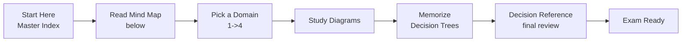
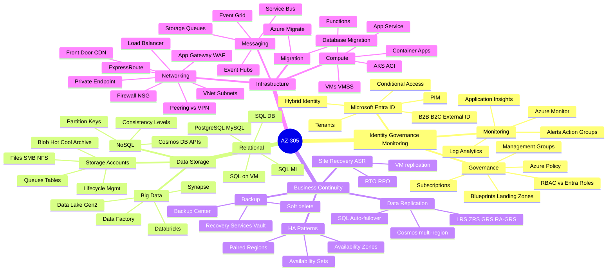
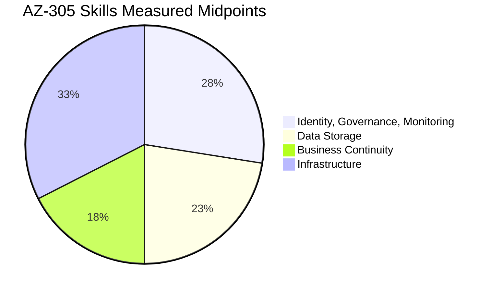
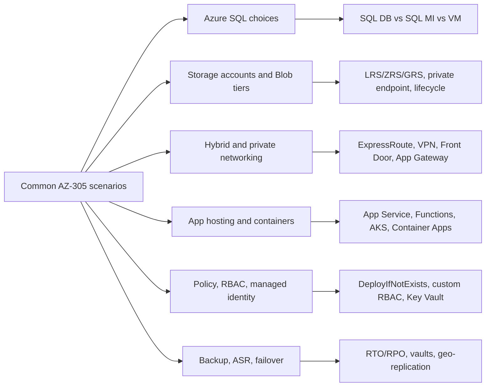
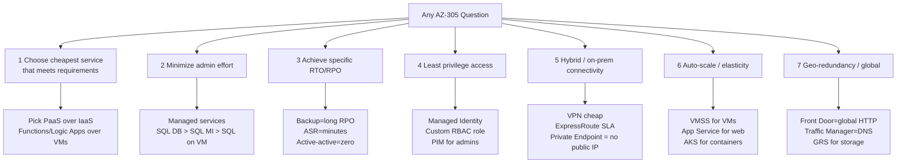
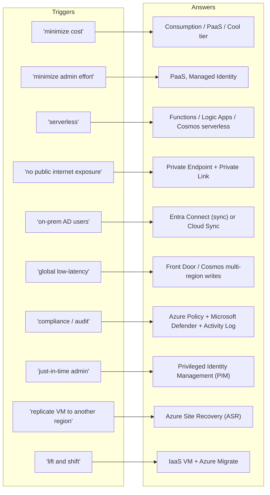

# AZ-305 Visual Study Guide - Master Index

> **Designing Microsoft Azure Infrastructure Solutions**
> Built from the Microsoft Learn skills measured as of **April 17, 2026**. This is a concept study layer: diagrams, decision trees, and original summaries only.

---

## How to use this guide

---

## The 4 Exam Domains - Mind Map

---

## Official Skills Weighting

| Slice | Weight | Jump to chapter |
| --- | --- | --- |
| Identity, Governance, Monitoring | **25-30%** | [01 Identity + Governance](01-identity-governance-monitoring.md) |
| Data Storage | **20-25%** | [02 Data Storage](02-data-storage.md) |
| Business Continuity | **15-20%** | [03 Business Continuity](03-business-continuity.md) |
| Infrastructure | **30-35%** | [04 Infrastructure](04-infrastructure.md) |

Coverage note: this guide follows the official Microsoft Learn AZ-305 [skills measured](https://learn.microsoft.com/credentials/certifications/resources/study-guides/az-305) weights - Identity, Governance, and Monitoring **25-30%**, Data Storage **20-25%**, Business Continuity **15-20%**, and Infrastructure **30-35%**.

---

## Service emphasis map

Core services to know across the four measured skills: Azure SQL Database, Blob/Storage accounts, ExpressRoute, virtual networks, AKS, App Service, Azure Policy, Data Factory, Cosmos DB, Load Balancer, Application Gateway, Traffic Manager, Log Analytics, Key Vault, Synapse, Databricks, and managed identity.

---

## Domain files in this guide

| # | Domain | File | Focus |
|---|--------|------|-------|
| 1 | Identity, Governance & Monitoring | [01-identity-governance-monitoring.md](01-identity-governance-monitoring.md) | Entra ID, RBAC, Policy, Monitor |
| 2 | Data Storage Solutions | [02-data-storage.md](02-data-storage.md) | SQL, Cosmos, Blob, Synapse |
| 3 | Business Continuity (BCDR) | [03-business-continuity.md](03-business-continuity.md) | Backup, ASR, HA, Replication |
| 4 | Infrastructure Solutions | [04-infrastructure.md](04-infrastructure.md) | Compute, Network, Migration |
| | **Exam Decision Reference** | [05-exam-cheatsheet.md](05-exam-cheatsheet.md) | Decision trees + scenario keyword map |
| | **Concept & Reference Index** | [06-references.md](06-references.md) | Every concept linked to Microsoft Learn |
| + | **Extra Concepts** | [07-extra-az305-concepts.md](07-extra-az305-concepts.md) | Architecture method + edge-case concepts |
| + | **Microsoft Learn Summaries** | [08-learn-summaries.md](08-learn-summaries.md) | Per-service overviews + recreated architecture diagrams |
| + | **Architectures - AZ-305** | [09-arch-az305.md](09-arch-az305.md) | Reference architectures mapped to each skill area |

---

## The 7 Core Question Patterns in AZ-305

---

## The "Magic Words" Translator

When the exam uses these phrases, immediately think of these services:

---

## Recommended study order

```mermaid
gantt
    title Suggested 8-day plan
    dateFormat X
    axisFormat Day %d
    section Core
    Identity & Governance :a1, 0, 1d
    Monitoring add-on :a2, after a1, 1d
    Data Storage :a3, after a2, 2d
    section Resilience & Infra
    Business Continuity :b1, after a3, 1d
    Infrastructure :b2, after b1, 1d
    section Final
    Decision reference + practice :c1, after b2, 2d
```

 **Next:** open [01-identity-governance-monitoring.md](01-identity-governance-monitoring.md)
