# Domain 1 - Identity, Governance & Monitoring

> Big idea: **WHO** can do **WHAT**, **WHERE**, and how do we **SEE** what happened.
>
> Maps to AZ-305 measured skill **Design identity, governance, and monitoring solutions** (~25-30%). Reference: [Microsoft Learn AZ-305 study guide](https://learn.microsoft.com/credentials/certifications/resources/study-guides/az-305) - [Microsoft Entra documentation](https://learn.microsoft.com/entra/) - [Azure RBAC](https://learn.microsoft.com/azure/role-based-access-control/overview) - [Azure Policy](https://learn.microsoft.com/azure/governance/policy/overview) - [Azure Monitor](https://learn.microsoft.com/azure/azure-monitor/overview).

---

## Domain mind map

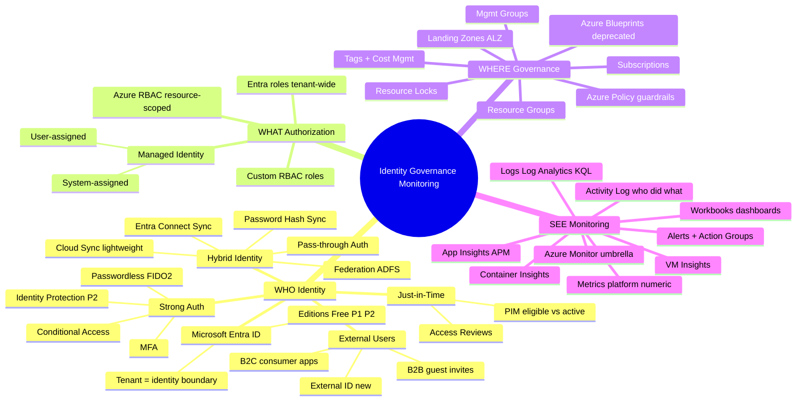

---

## Scenario patterns to recognize

AZ-305 case-study questions repeatedly test identity and governance as **architecture constraints**, not isolated vocabulary. Watch for these patterns:

| Scenario clue | What to think |
|---|---|
| App must access Key Vault or storage without credentials | **Managed identity** plus the right data-plane RBAC role |
| Users need least-privilege Azure access | Built-in RBAC first, custom RBAC only for missing `Actions`/`DataActions` |
| Policy must remediate SQL TDE, diagnostics, or tags | Azure Policy **DeployIfNotExists** or **Modify** with managed identity |
| Many subscriptions need shared controls | Management groups + initiatives + inherited RBAC/policy |
| Admins need temporary elevated access | **PIM**, MFA, approval, time-bound activation |
| Monitor web/API failures or log patterns | Application Insights or Log Analytics query alert + action group |

Official weight: **25-30%** of AZ-305.

### Hybrid identity decision tree

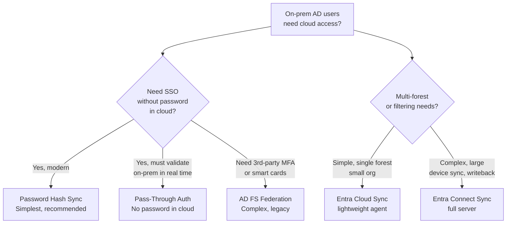

**Exam trick:** "Minimize on-prem footprint" -> **Cloud Sync** or **PHS**. "Real-time disabled accounts" -> **Pass-Through Auth**.

---

### Entra editions - what unlocks what?

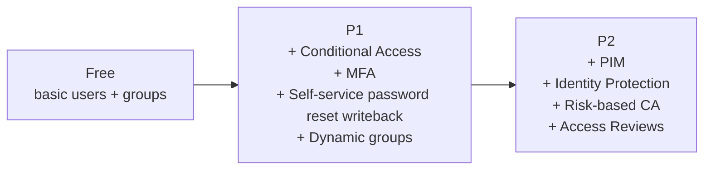

| Need | Edition |
|---|---|
| MFA enforcement via CA | **P1** |
| Just-in-time admin (PIM) | **P2** |
| Risky sign-in detection | **P2** |
| Access reviews | **P2** |

---

### Conditional Access - the IF-THEN engine

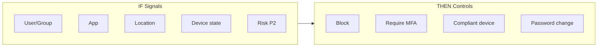

**Pattern:** "Require MFA only when signing in from outside corporate network" -> CA policy with **named location** as condition.

---

### B2B vs B2C vs External ID

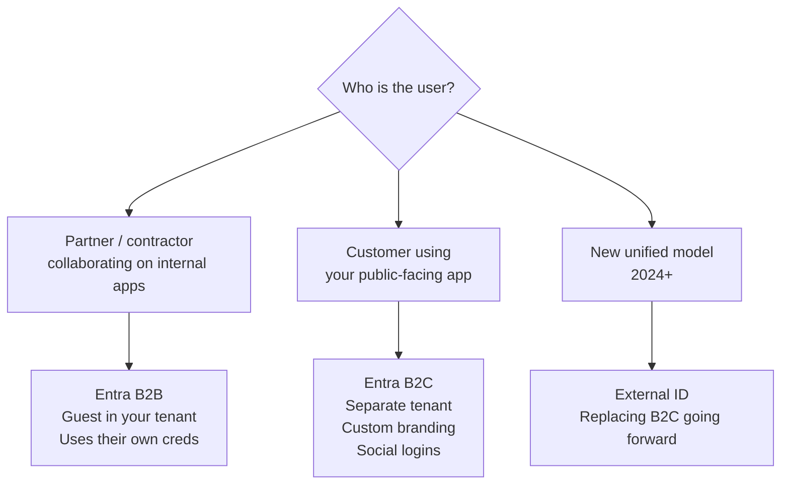

---

### PIM - Privileged Identity Management

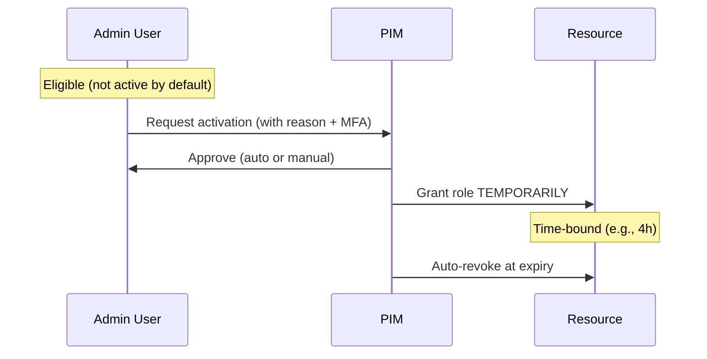

**Use PIM when:** "minimize standing admin permissions", "just-in-time access", "approval workflow for admins".

---

## 2 Authorization - RBAC vs Entra Roles

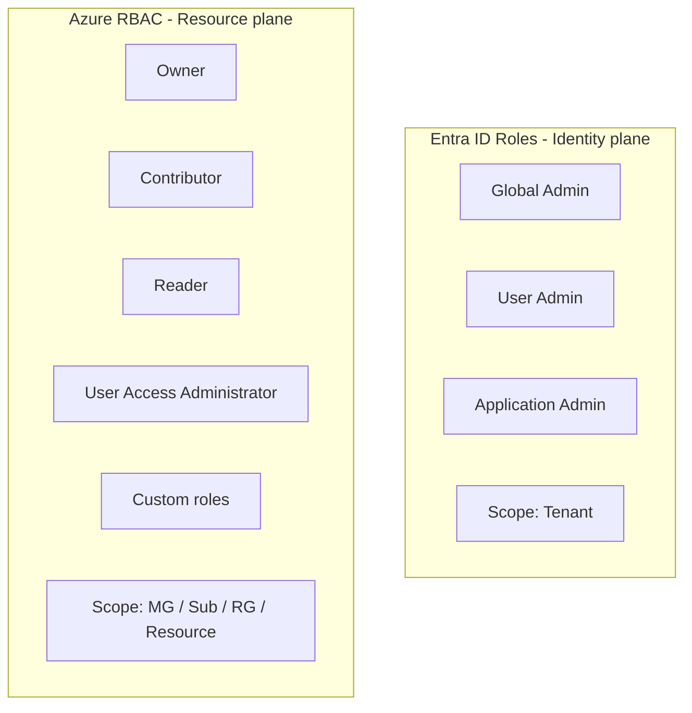

**Memorize:**
- **Manage users/groups/apps** -> Entra role
- **Manage VMs/storage/networks** -> Azure RBAC role
- **Both?** -> User Access Administrator + assignments

### Custom RBAC role JSON pattern

```json
{
  "Name": "VM Operator",
  "Actions": ["Microsoft.Compute/virtualMachines/start/action",
              "Microsoft.Compute/virtualMachines/restart/action"],
  "NotActions": [],
  "AssignableScopes": ["/subscriptions/<id>"]
}
```

 **Exam:** Custom role needs `AssignableScopes`. Lowest-privilege built-in role: prefer **Reader** + targeted custom over **Contributor**.

---

### Managed Identity decision

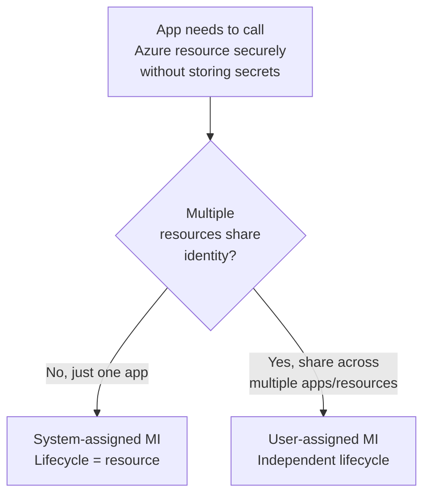

 **Exam:** "Connect from VM to Key Vault without storing credentials" -> **Managed Identity** + Key Vault access policy/RBAC.

---

## 3 Governance - the WHERE

### Hierarchy you must memorize

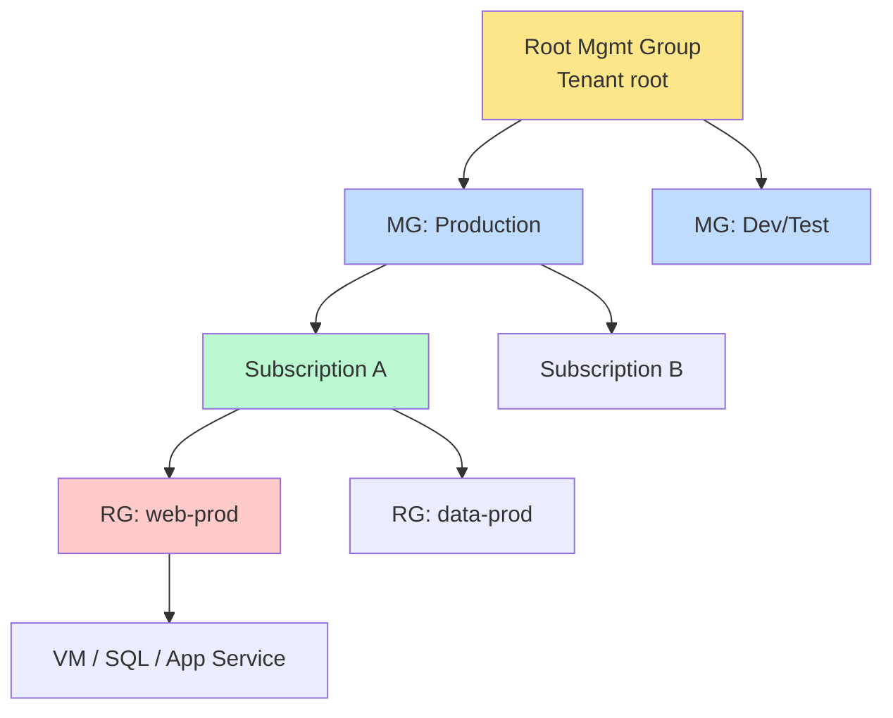

**Inheritance:** Policy & RBAC flow **downward**. Apply at the highest level possible.

---

### Azure Policy vs RBAC

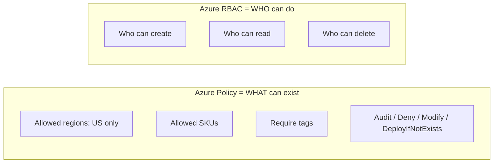

 **Exam triggers:**
- "Prevent deployment outside East US" -> **Policy**: Allowed locations
- "Auto-add tag from RG" -> Policy effect **Modify**
- "Auto-deploy diagnostics" -> **DeployIfNotExists** (needs Managed Identity)

---

### Initiatives, Blueprints, Landing Zones

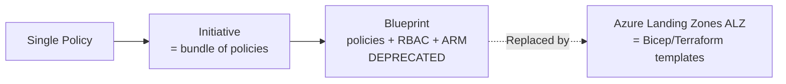

 **2026+ exam:** Prefer **ALZ + Initiatives + Template Specs** over Blueprints.

---

### Resource Locks

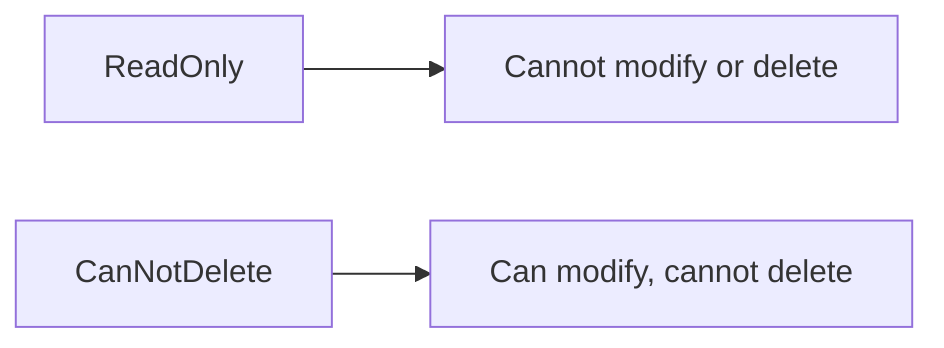

Apply at MG / Sub / RG / Resource. **Inherits down**. Owners + User Access Administrators can manage locks.

---

## 4 Monitoring - the SEE

### The Azure Monitor universe

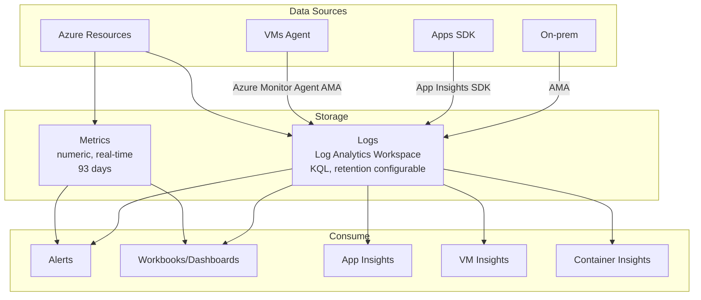

 **Critical fact:** **Azure Monitor Agent (AMA)** replaces the old MMA/OMS agent. Use **Data Collection Rules (DCR)** to configure what's collected.

---

### Alert decision tree

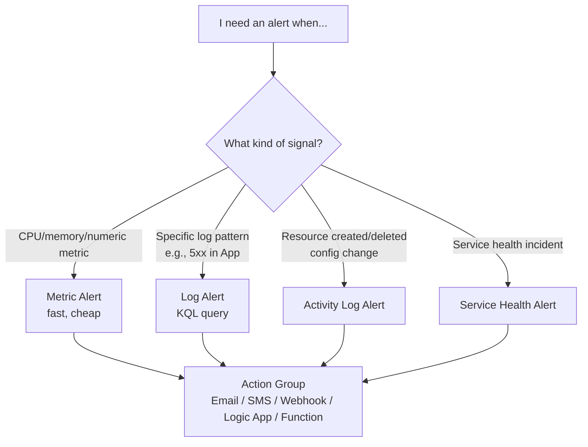

---

### KQL must-know patterns

```kusto
// Failed sign-ins last 24h
SigninLogs
| where TimeGenerated > ago(24h)
| where ResultType != 0
| summarize count() by UserPrincipalName

// VM CPU > 80%
Perf
| where ObjectName == "Processor" and CounterName == "% Processor Time"
| where CounterValue > 80
| summarize avg(CounterValue) by Computer, bin(TimeGenerated, 5m)
```

---

### When to use which monitoring tool

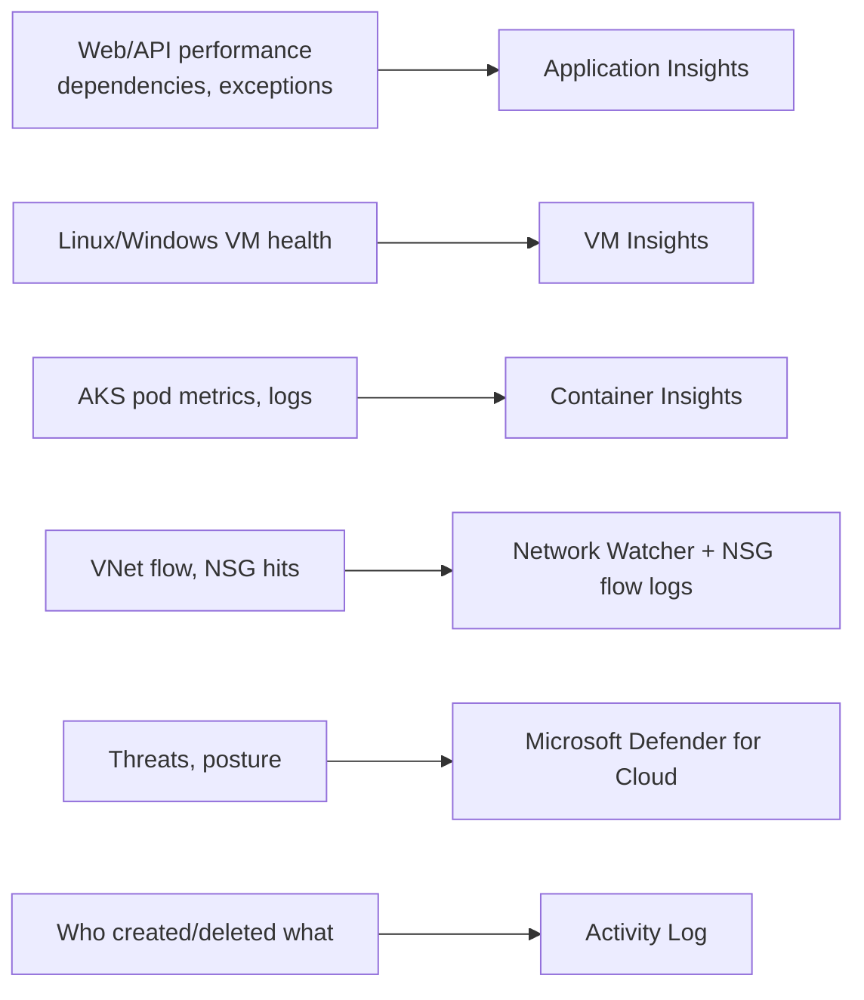

---

## Domain 1 cheat-sheet card

| Scenario | Answer |
|---|---|
| Sync on-prem users, minimal on-prem servers | **Entra Cloud Sync** |
| Real-time on-prem password validation | **Pass-Through Auth** |
| Just-in-time admin role | **PIM** (P2) |
| Block sign-in from risky IP | **Conditional Access** + Identity Protection |
| App accesses Key Vault without secrets | **Managed Identity** |
| Allow only specific VM SKUs | **Azure Policy** Allowed SKUs |
| Auto-tag resources | Policy effect **Modify** |
| Stop accidental deletion | **Resource Lock CanNotDelete** |
| Alert on VM CPU > 90% | **Metric Alert** |
| Alert on KQL log pattern | **Log Alert** |
| Centralize logs from 30 subscriptions | One **Log Analytics Workspace** + DCRs |
| Customer-facing identity | **Entra External ID / B2C** |
| Partner collaboration | **B2B guest** |

---

## References (Microsoft Learn)

- [AZ-305 study guide](https://learn.microsoft.com/credentials/certifications/resources/study-guides/az-305)
- [Microsoft Entra ID overview](https://learn.microsoft.com/entra/fundamentals/whatis)
- [Conditional Access](https://learn.microsoft.com/entra/identity/conditional-access/overview)
- [Privileged Identity Management (PIM)](https://learn.microsoft.com/entra/id-governance/privileged-identity-management/pim-configure)
- [Azure RBAC](https://learn.microsoft.com/azure/role-based-access-control/overview)
- [Azure Policy](https://learn.microsoft.com/azure/governance/policy/overview)
- [Management groups](https://learn.microsoft.com/azure/governance/management-groups/overview)
- [Azure Monitor](https://learn.microsoft.com/azure/azure-monitor/overview) - [Log Analytics](https://learn.microsoft.com/azure/azure-monitor/logs/log-analytics-overview) - [Application Insights](https://learn.microsoft.com/azure/azure-monitor/app/app-insights-overview)

 **Next:** [02-data-storage.md](02-data-storage.md)
