# Domain 2 - Data Storage Solutions

> Maps to AZ-305 measured skill **Design data storage solutions** (~20-25%). Reference: [Microsoft Learn AZ-305 study guide](https://learn.microsoft.com/credentials/certifications/resources/study-guides/az-305) - [Azure SQL options](https://learn.microsoft.com/azure/azure-sql/azure-sql-iaas-vs-paas-what-is-overview) - [Azure Cosmos DB](https://learn.microsoft.com/azure/cosmos-db/introduction) - [Azure Storage](https://learn.microsoft.com/azure/storage/common/storage-introduction) - [Azure Synapse](https://learn.microsoft.com/azure/synapse-analytics/overview-what-is).

> Big idea: **Right database for the right data shape**, with right **consistency**, **scale**, and **cost**.

---

## Domain mind map

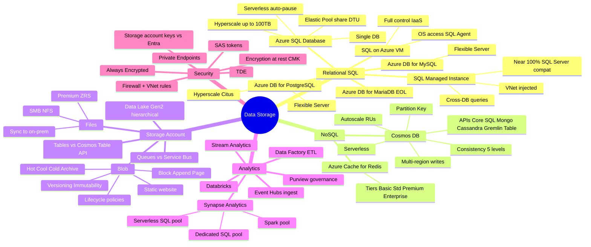

---

## 1 Pick the relational database

## Scenario patterns to recognize

AZ-305 scenarios is very data-heavy. Many questions are service-selection traps where two answers are technically possible, but only one meets compatibility, downtime, cost, or admin-effort constraints.

| Scenario clue | What to think |
|---|---|
| Lift-and-shift SQL with SQL Agent, cross-database query, or instance-level features | **Azure SQL Managed Instance** |
| New cloud relational app, minimal admin | **Azure SQL Database** |
| Full OS or unsupported SQL Server feature required | **SQL Server on Azure VM** |
| Many small databases with variable usage | **Elastic pool** |
| Very large SQL database or fast restore | **Hyperscale** |
| Global document data and low-latency reads/writes | **Cosmos DB**, regions, consistency, partition key |
| On-prem apps need private access to storage | **Private Endpoint** + Private DNS + disable public access when required |
| Long-term blob retention at lowest cost | Lifecycle policy to Cool/Cold/Archive plus immutability if compliance requires it |
| Copy and transform data between systems | **Data Factory** or Synapse pipelines; Synapse Link for Cosmos analytical store |

Official weight: **20-25%** of AZ-305.

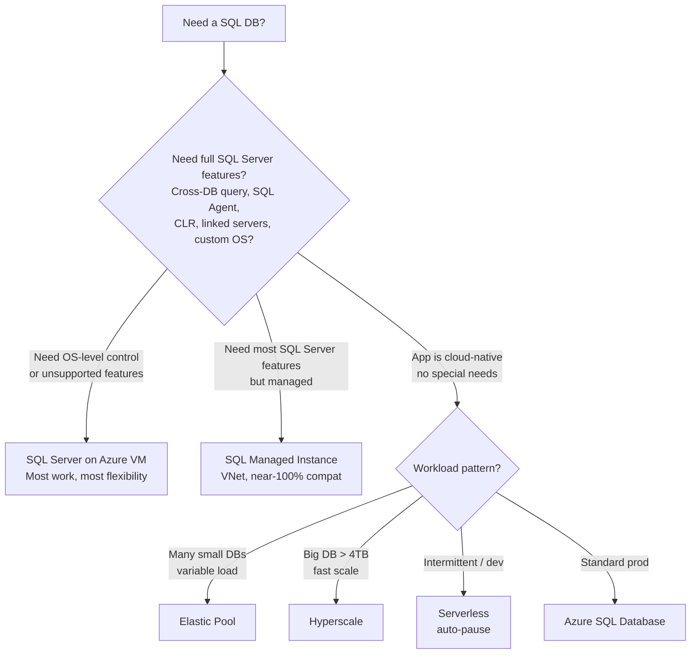

| Tier | When | Compat | Effort |
|---|---|---|---|
| **SQL on VM** | Custom needs, full control | 100% | High (you patch, you backup) |
| **SQL MI** | Lift & shift on-prem SQL with minimal change | ~100% | Medium |
| **SQL DB** | New cloud apps | ~95% | Low |

 **Exam triggers:**
- "Cross-database queries" -> **MI** (SQL DB needs Elastic Query workaround)
- "SQL Agent jobs" -> **MI** or **VM**
- "Lift-and-shift with minimal code change + VNet integration" -> **MI**
- "Variable workload, save cost" -> **Serverless** SQL DB
- "Up to 100 TB, fast restore" -> **Hyperscale**

---

## 2 Cosmos DB - the NoSQL champion

### Choose the API

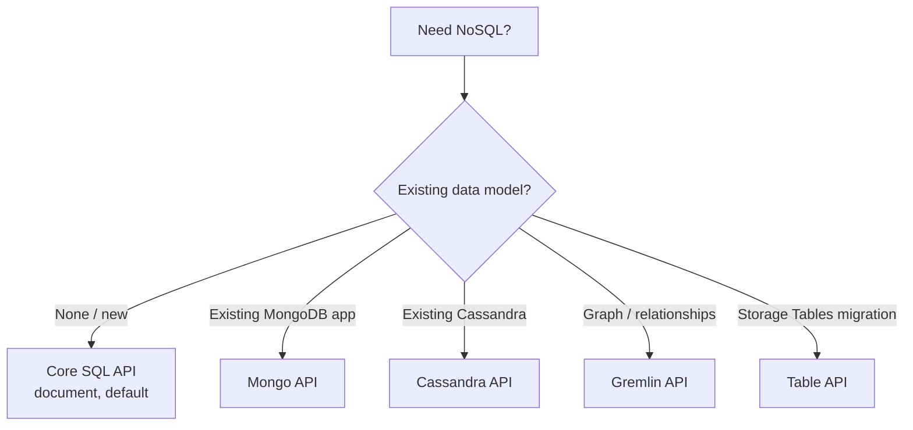

### The 5 consistency levels (memorize order!)

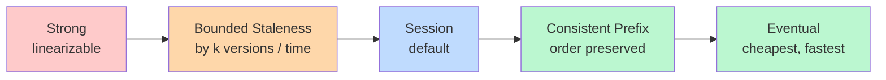

| Level | Latency | Throughput | Use |
|---|---|---|---|
| Strong | High | Low | Banking, leaderboards (single region only multi-write) |
| Bounded Staleness | Med | Med | "Last 5 mins ok" |
| **Session** | Low | High | **Default** - read-your-writes per user |
| Consistent Prefix | Low | High | Social feeds |
| Eventual | Lowest | Highest | View counters, telemetry |

 **Exam:** "Read your own write but not others' immediately" -> **Session**.

### Partition key rules

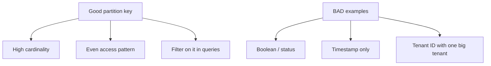

### Capacity modes

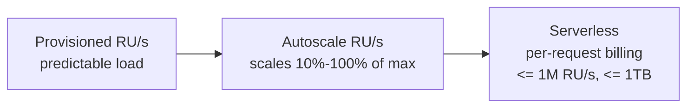

 "Sporadic dev workload, pay per request" -> **Serverless**. "Spiky prod" -> **Autoscale**.

---

## 3 Storage Account - the Swiss Army knife

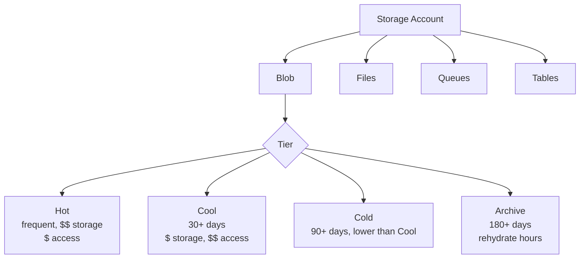

### Blob tier decision

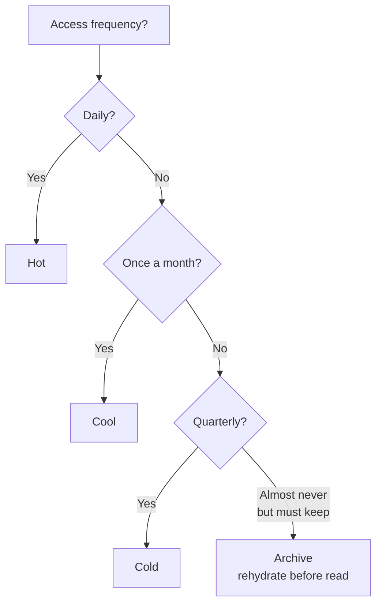

 **Lifecycle Mgmt rule example:**
- Move to Cool after 30 days of no access
- Move to Archive after 180 days
- Delete after 7 years (compliance)

### Storage redundancy ladder

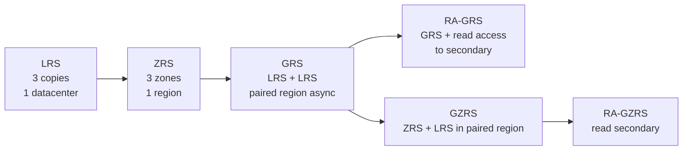

| Need | Choose |
|---|---|
| Cheapest, in-region only | **LRS** |
| Survive zone outage | **ZRS** |
| Survive region outage | **GRS** / **GZRS** |
| Read from secondary during outage | **RA-GRS** / **RA-GZRS** |

 **Archive tier does NOT support ZRS/GZRS** - only LRS/GRS in many cases. **Premium block blob** = LRS or ZRS only.

---

### Azure Files - SMB vs NFS vs Sync

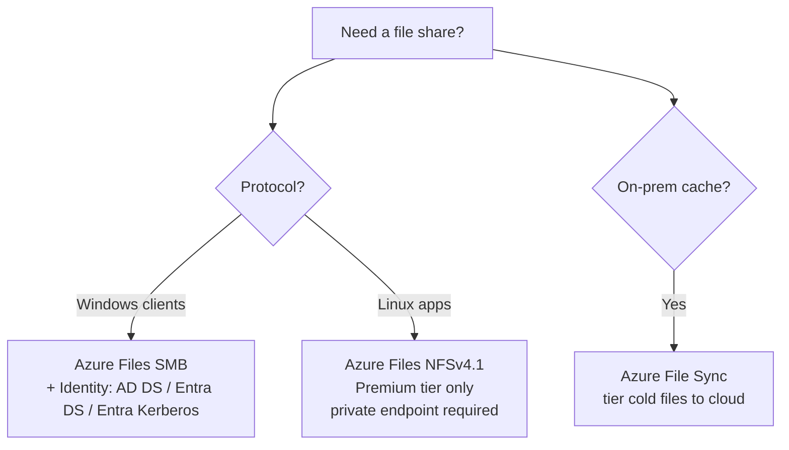

 "Lift-and-shift Windows file server" -> **Azure Files + Azure File Sync** (cloud tiering).

---

### Queues vs Service Bus vs Event Hubs vs Event Grid

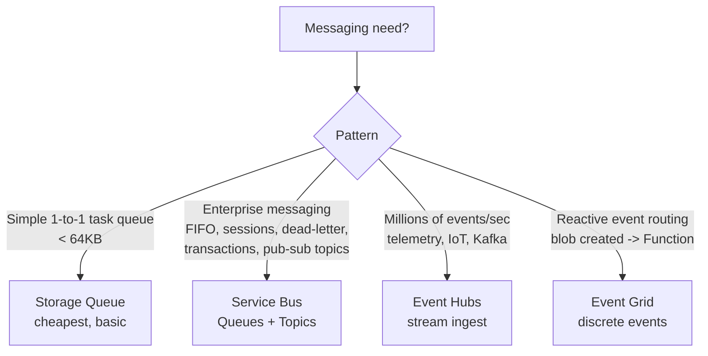

| Service | Model | Throughput | Order | Pattern |
|---|---|---|---|---|
| Storage Queue | Pull | Low | No | Simple |
| Service Bus | Pull | Med | FIFO/sessions | Enterprise |
| Event Hubs | Pull | Massive | Per partition | Streaming |
| Event Grid | Push | High | No | Reactive |

---

## 4 Big Data & Analytics

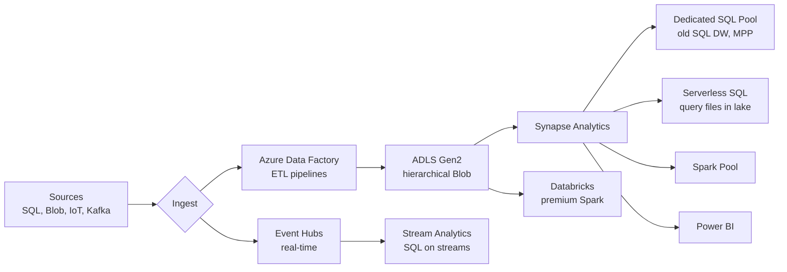

 **Exam:**
- "Petabyte data warehouse, MPP" -> **Synapse Dedicated SQL Pool**
- "Query parquet/CSV in Data Lake without provisioning" -> **Synapse Serverless SQL**
- "Code-first data engineers, ML, Delta Lake" -> **Azure Databricks**
- "Drag-drop ETL with 100+ connectors" -> **Azure Data Factory** (or Synapse Pipelines)
- "Real-time SQL on event stream" -> **Stream Analytics**
- "Catalog & lineage across all data" -> **Microsoft Purview**

---

## 5 Securing data

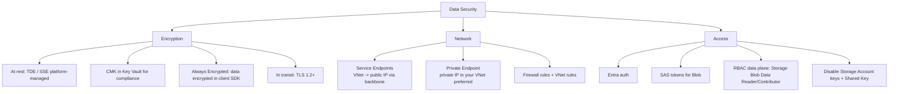

 **Always Encrypted** vs **TDE**:
- **TDE** = encrypts at rest on disk (DBA can still see data via SQL)
- **Always Encrypted** = encrypts in client driver, **DBA cannot read sensitive columns**

 **Private Endpoint** vs **Service Endpoint**:
- **Service Endpoint** = traffic stays on Azure backbone but goes to public IP
- **Private Endpoint** = resource gets a **private IP in your VNet**; can disable public access entirely -> **stronger isolation**

---

## Domain 2 cheat-sheet

| Scenario | Answer |
|---|---|
| Lift-and-shift on-prem SQL with cross-DB queries | **SQL Managed Instance** |
| New cloud app, simple SQL | **Azure SQL Database** |
| 80 TB SQL with fast restore | **Hyperscale** |
| Variable / dev SQL workload | **SQL DB Serverless** |
| Multi-region active writes globally | **Cosmos DB** multi-region writes |
| Read your own writes, NoSQL | **Cosmos Session** consistency |
| Migrate MongoDB app | **Cosmos for MongoDB** |
| Cheap object storage rarely accessed | **Cool / Cold / Archive** Blob |
| Survive region outage, read secondary | **RA-GZRS** |
| Replace on-prem file server | **Azure Files + File Sync** |
| Message queue with sessions/FIFO | **Service Bus** |
| 1M events/sec ingest | **Event Hubs** |
| Blob created -> trigger Function | **Event Grid** |
| Petabyte BI warehouse | **Synapse Dedicated SQL Pool** |
| Query data lake files ad-hoc | **Synapse Serverless SQL** |
| Disable public access to storage | **Private Endpoint** + firewall = Deny |
| DBA must NOT see PII columns | **Always Encrypted** |
| Auto-archive blobs after 180 days | **Lifecycle Management** policy |

---

## References (Microsoft Learn)

- [AZ-305 study guide](https://learn.microsoft.com/credentials/certifications/resources/study-guides/az-305)
- [Choose an Azure SQL option](https://learn.microsoft.com/azure/azure-sql/azure-sql-iaas-vs-paas-what-is-overview)
- [Azure Cosmos DB consistency levels](https://learn.microsoft.com/azure/cosmos-db/consistency-levels)
- [Azure Storage redundancy](https://learn.microsoft.com/azure/storage/common/storage-redundancy)
- [Blob access tiers](https://learn.microsoft.com/azure/storage/blobs/access-tiers-overview) - [Lifecycle management](https://learn.microsoft.com/azure/storage/blobs/lifecycle-management-overview)
- [Azure Synapse Analytics](https://learn.microsoft.com/azure/synapse-analytics/overview-what-is)
- [Event Hubs](https://learn.microsoft.com/azure/event-hubs/event-hubs-about) - [Service Bus](https://learn.microsoft.com/azure/service-bus-messaging/service-bus-messaging-overview) - [Event Grid](https://learn.microsoft.com/azure/event-grid/overview)
- [Always Encrypted](https://learn.microsoft.com/sql/relational-databases/security/encryption/always-encrypted-database-engine)

 **Next:** [03-business-continuity.md](03-business-continuity.md)
