# Domain 3 - Business Continuity (BCDR)

> Maps to AZ-305 measured skill **Design business continuity solutions** (~15-20%). Reference: [Microsoft Learn AZ-305 study guide](https://learn.microsoft.com/credentials/certifications/resources/study-guides/az-305) - [Azure Backup](https://learn.microsoft.com/azure/backup/backup-overview) - [Azure Site Recovery](https://learn.microsoft.com/azure/site-recovery/site-recovery-overview) - [Azure regions and availability zones](https://learn.microsoft.com/azure/reliability/availability-zones-overview) - [Storage redundancy](https://learn.microsoft.com/azure/storage/common/storage-redundancy).

> Big idea: **How fast** can we recover (RTO), and **how much data** can we lose (RPO)?

---

## Domain mind map

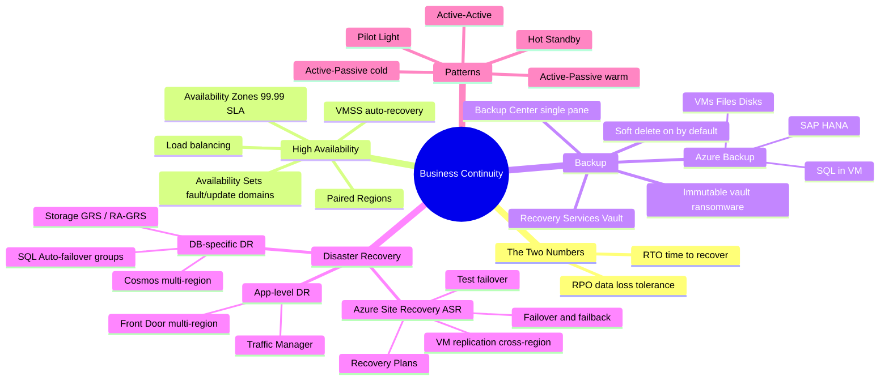

---

## 1 The two sacred numbers

## Scenario patterns to recognize

AZ-305 case-study questions keep coming back to recovery objective matching. Read every BCDR scenario in this order: **what fails, how much downtime is allowed, how much data loss is allowed, and which service owns recovery**.

| Scenario clue | What to think |
|---|---|
| VM or whole workload must recover in another region with minutes of RPO | **Azure Site Recovery** |
| Need point-in-time restore or long-term retention | **Azure Backup**, SQL backups, or database-native retention |
| Need to prove DR without touching production | **ASR test failover** in an isolated network |
| SQL needs app connection string stability after failover | **Auto-failover group** listener |
| Cosmos needs near-zero global write downtime | Multi-region writes; avoid Strong consistency with multi-write |
| Storage must survive regional outage and allow secondary reads | **RA-GRS** or **RA-GZRS** |
| Ransomware or destructive admin risk | Soft delete, immutability, multi-user authorization, alerts |

Official weight: **15-20%** of AZ-305.

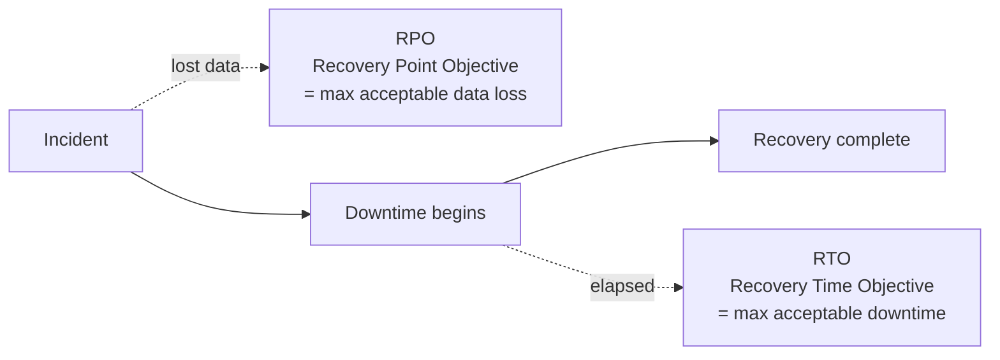

 **Memorize:**
- **RPO is in the past** (how far back is your last good copy)
- **RTO is in the future** (how long to get back online)

### Mapping requirements -> solution

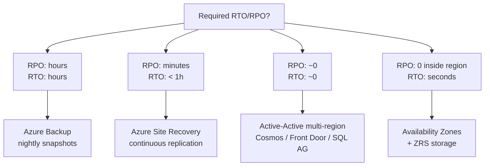

---

## 2 High Availability inside one region

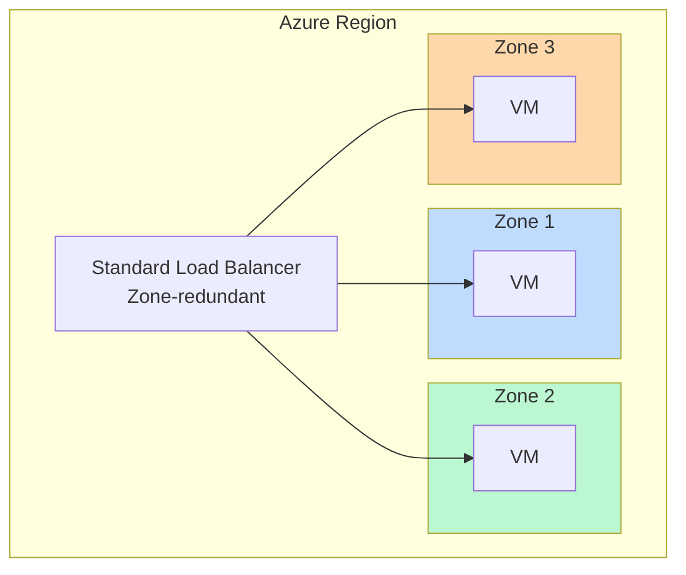

| Feature | SLA | Protects against |
|---|---|---|
| Single VM Premium SSD | 99.9% | Nothing structural |
| **Availability Set** (FD/UD) | 99.95% | Rack/host failure, planned maint |
| **Availability Zone** | **99.99%** | **Datacenter failure** |
| Multi-region | 99.99%+ | Region failure |

 **Exam:** "Highest SLA in a single region" -> **Availability Zones** (not sets!).
 You **cannot mix** Availability Set and Availability Zone for the same VM.

### Availability Set internals

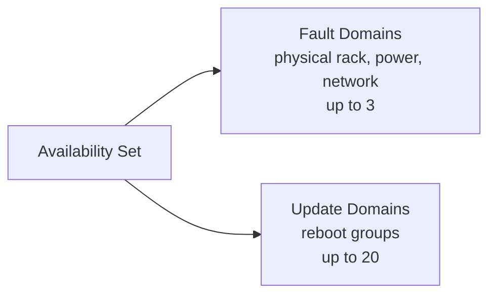

---

## 3 Azure Backup

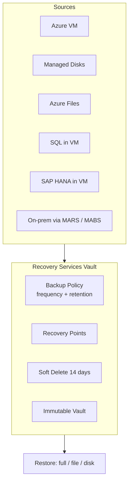

### Vault redundancy decision

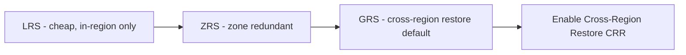

 **Default for prod:** **GRS + CRR enabled** so you can restore in paired region.

### Anti-ransomware features (memorize!)

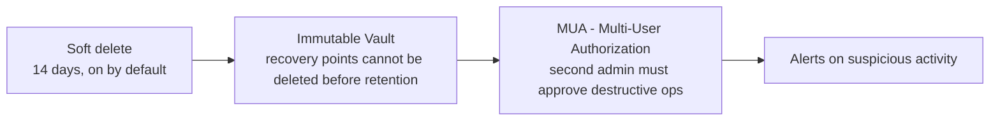

---

## 4 Azure Site Recovery (ASR)

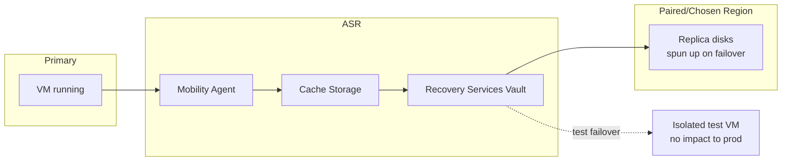

| Mode | Use |
|---|---|
| **Test failover** | Validate DR plan with no impact (creates isolated copy) |
| **Planned failover** | Zero data loss; shuts down primary first |
| **Unplanned failover** | Real disaster; possible small data loss |
| **Failback** | Return to primary after recovery |

 **Recovery Plan** = ordered sequence of VM groups, scripts, manual actions for orchestrated failover (e.g., DB tier first, then app, then web).

 ASR scenarios on the exam:
- **Azure VM -> Azure VM** (cross-region) 
- VMware/physical -> Azure 
- Hyper-V -> Azure 
- Azure -> on-prem (failback) 

---

## 5 Database-specific DR

### SQL Database - Auto-failover groups

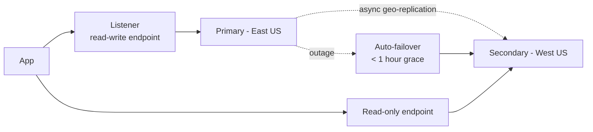

**Key facts:**
- Works for **SQL DB** and **SQL MI**
- Provides **listener endpoints** (no app connection-string change)
- **RPO** typically seconds, **RTO** ~1 minute
- For **MI**: failover groups across regions; instances must be in **paired** regions

### Cosmos DB

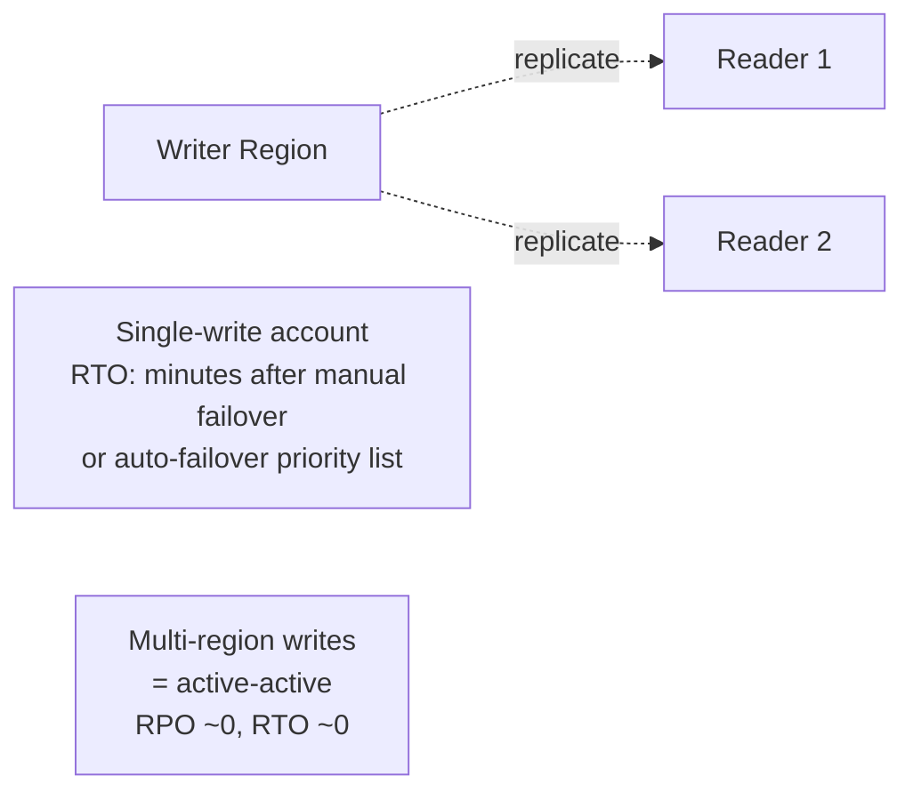

### Storage replication recap

| Type | Purpose |
|---|---|
| LRS / ZRS | HA, no DR |
| GRS / GZRS | DR async |
| RA-GRS / RA-GZRS | DR + read secondary anytime |

---

## 6 Application-level DR & global routing

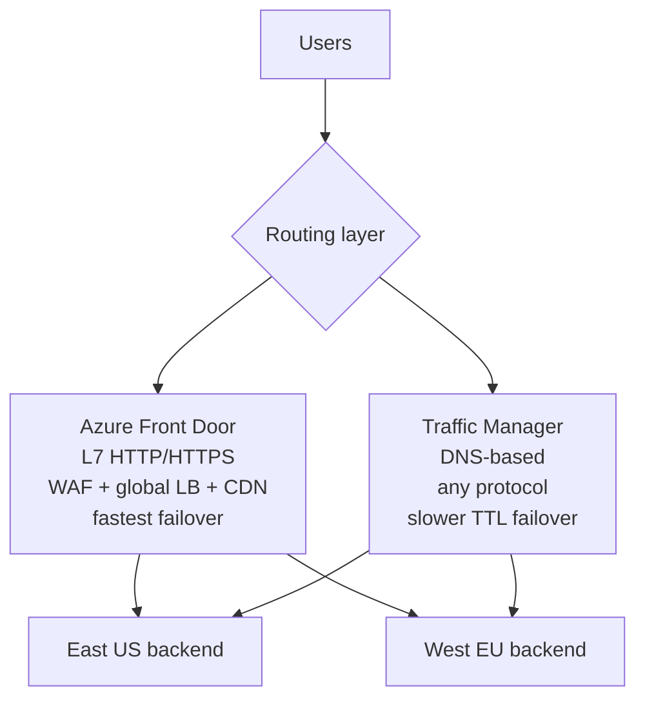

### Front Door vs Traffic Manager

| Feature | Front Door | Traffic Manager |
|---|---|---|
| Layer | **L7 HTTP/HTTPS** | **DNS** (any TCP/UDP) |
| Failover | Connection-level, fast | TTL-dependent (~minutes) |
| WAF | Built-in | |
| TLS terminate | |  |
| Use | Global web apps | Generic, on-prem endpoints |

 "Active-active global website with WAF" -> **Azure Front Door Premium**.
 "Route to on-prem datacenter as DR" -> **Traffic Manager**.

---

## 7 DR architecture patterns

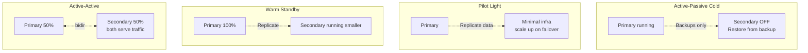

| Pattern | RTO | RPO | Cost |
|---|---|---|---|
| Cold (backup only) | Hours-days | Hours | $ |
| Pilot light (ASR) | < 1h | Minutes | $$ |
| Warm standby | Minutes | Seconds | $$$ |
| Active-active | ~0 | ~0 | $$$$ |

---

## Domain 3 cheat-sheet

| Scenario | Answer |
|---|---|
| Survive datacenter (zone) failure, single region | **Availability Zones** + ZRS |
| Survive region failure, VMs | **Azure Site Recovery** |
| Backup VM/files/SQL nightly | **Azure Backup + Recovery Services Vault** |
| Ransomware-resistant backups | **Immutable Vault + Soft Delete + MUA** |
| RPO = seconds, RTO = minutes for SQL | **Auto-failover groups** |
| Multi-region active writes for NoSQL | **Cosmos DB multi-region writes** |
| Global HTTP app failover with WAF | **Azure Front Door** |
| DNS-based failover to on-prem | **Traffic Manager** |
| Test DR without impacting prod | **ASR Test Failover** |
| Restore VM in a different region | **GRS vault + CRR** |
| Coordinate failover order across tiers | **ASR Recovery Plan** |
| Cheapest DR (long RTO acceptable) | **Backup-only / Cold** |
| Highest SLA, lowest RTO/RPO | **Active-Active multi-region** |
| 99.99% VM SLA in one region | **Availability Zones** |

---

## References (Microsoft Learn)

- [AZ-305 study guide](https://learn.microsoft.com/credentials/certifications/resources/study-guides/az-305)
- [Azure Backup overview](https://learn.microsoft.com/azure/backup/backup-overview)
- [Azure Site Recovery overview](https://learn.microsoft.com/azure/site-recovery/site-recovery-overview)
- [Reliability - availability zones](https://learn.microsoft.com/azure/reliability/availability-zones-overview) - [Region pairs](https://learn.microsoft.com/azure/reliability/cross-region-replication-azure)
- [Azure SQL high availability](https://learn.microsoft.com/azure/azure-sql/database/high-availability-sla) - [Failover groups](https://learn.microsoft.com/azure/azure-sql/database/auto-failover-group-overview)
- [Cosmos DB business continuity](https://learn.microsoft.com/azure/cosmos-db/high-availability)
- [Azure Front Door](https://learn.microsoft.com/azure/frontdoor/front-door-overview) - [Traffic Manager](https://learn.microsoft.com/azure/traffic-manager/traffic-manager-overview)

 **Next:** [04-infrastructure.md](04-infrastructure.md)
