# Domain 4 - Infrastructure Solutions

> Maps to AZ-305 measured skill **Design infrastructure solutions** (~30-35%). Reference: [Microsoft Learn AZ-305 study guide](https://learn.microsoft.com/credentials/certifications/resources/study-guides/az-305) - [Azure compute decision tree](https://learn.microsoft.com/azure/architecture/guide/technology-choices/compute-decision-tree) - [Networking architecture](https://learn.microsoft.com/azure/architecture/networking/) - [Azure Migrate](https://learn.microsoft.com/azure/migrate/migrate-services-overview) - [Cloud Adoption Framework](https://learn.microsoft.com/azure/cloud-adoption-framework/).

> Big idea: **Compute + Network + Migration + Messaging** = the bones of any Azure solution.

---

## Domain mind map

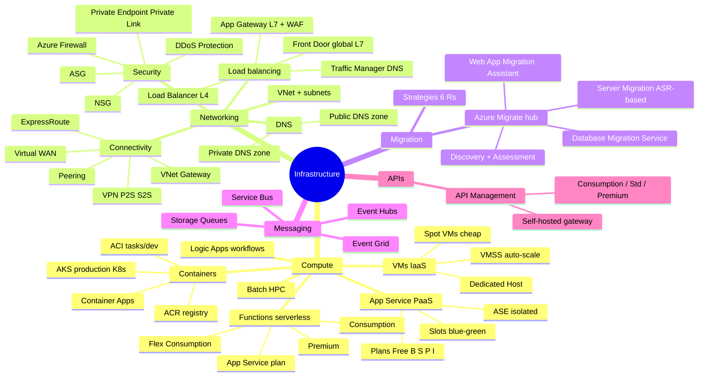

---

## 1 Compute decision tree (the most important diagram!)

## Scenario patterns to recognize

AZ-305 case-study questions lean hard into infrastructure choice questions: hosting model, hybrid connectivity, regional/global routing, and migration path. The right answer is usually the smallest managed service that satisfies a hard networking or operations requirement.

| Scenario clue | What to think |
|---|---|
| Python/.NET/Java web app, deployment slots, managed platform | **App Service** |
| Event-driven task or integration trigger | **Functions**; use Premium/Flex when VNet or cold-start constraints matter |
| Microservices with no Kubernetes management | **Container Apps** |
| Full Kubernetes, Windows node pools, ingress/service mesh control | **AKS** |
| Dedicated private bandwidth to on-prem | **ExpressRoute** |
| Global HTTPS app with WAF and acceleration | **Front Door Premium** |
| Regional HTTP routing or private backend WAF | **Application Gateway WAF_v2** |
| DNS failover or non-HTTP global endpoint | **Traffic Manager** |
| TCP/UDP inside a region | **Standard Load Balancer** |
| Migrate VMware/Hyper-V/physical servers | **Azure Migrate Server Migration** |

Official weight: **30-35%** of AZ-305.

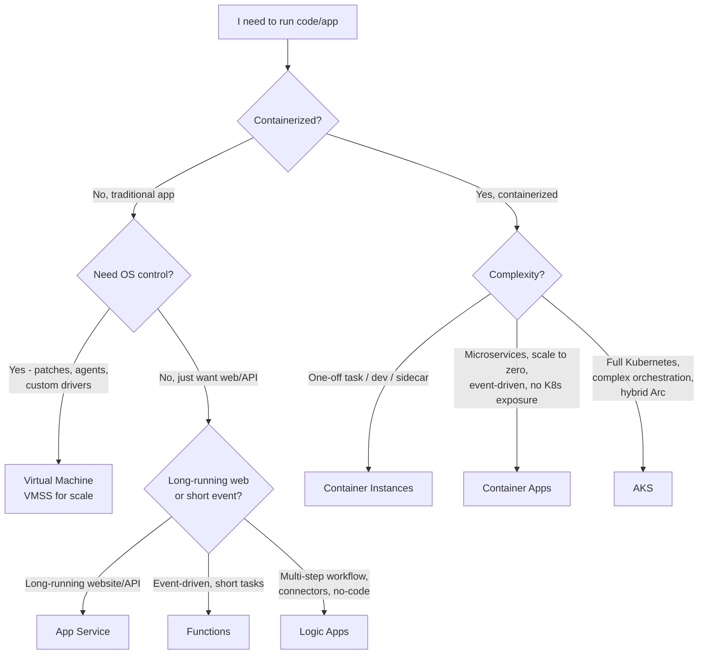

### Compute service comparison

| Service | Model | Scale | Pricing | Best for |
|---|---|---|---|---|
| **VM / VMSS** | IaaS | Manual/auto | Per-second | Legacy, custom OS |
| **App Service** | PaaS | Up to 30 inst | Plan-based | Web/API |
| **Functions** | Serverless | Event-based | Per execution (Consumption) | Triggers, glue |
| **Logic Apps** | iPaaS | Auto | Per action | Workflows w/ 400+ connectors |
| **ACI** | Container | None | Per-second | Burst, single container |
| **Container Apps** | Serverless K8s | KEDA-based, scale to 0 | Per-second | Microservices w/o K8s mgmt |
| **AKS** | Managed K8s | Cluster-level | Node-based | Full K8s, multi-cluster |
| **Batch** | Job scheduler | 1000s of nodes | Per VM | HPC, render |

 **Key exam clues:**
- "Scale to **zero** when idle, microservices, no K8s skills" -> **Container Apps**
- "Full K8s with custom CRDs / Istio / advanced networking" -> **AKS**
- "Run a script when a file lands in blob" -> **Functions** (Blob trigger)
- "Connect SaaS apps with no code" -> **Logic Apps**
- "Web app needs deployment slots / staging" -> **App Service** Standard+

---

## 2 App Service plans - pick the right tier

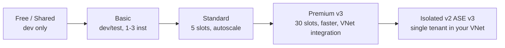

 **Need VNet integration?** Standard or higher.
 **Need full network isolation?** Isolated (App Service Environment v3).
 **Deployment slots for blue/green?** Standard (5 slots) or Premium (20).

---

## 3 Functions hosting plans

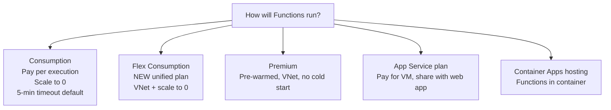

 "Avoid cold starts + VNet" historically -> **Premium**. Modern answer: **Flex Consumption**.

---

## 4 Networking - the foundation

### VNet anatomy

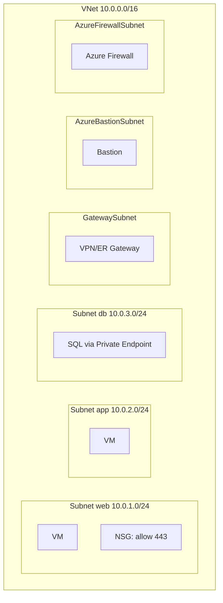

 **Reserved subnet names** must match exactly:
- `GatewaySubnet` (VPN/ExpressRoute) - **/27 or larger**
- `AzureBastionSubnet` - **/26 or larger**
- `AzureFirewallSubnet` - **/26 or larger**

---

### Hybrid connectivity decision

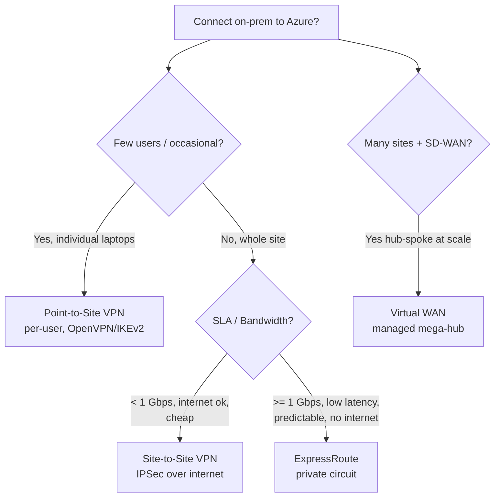

| Option | Bandwidth | SLA | Over internet? | Cost |
|---|---|---|---|---|
| P2S VPN | Modest | None | Yes | $ |
| S2S VPN | Up to ~1.25 Gbps | 99.9-99.95% | Yes | $$ |
| **ExpressRoute** | 50 Mbps - 100 Gbps | **99.95%** | **No** (private) | $$$$ |
| ER + VPN failover | Mix | High | Mix | $$$$ |

 **Exam:** "Predictable bandwidth, no internet path, SLA" -> **ExpressRoute**.

---

### VNet peering

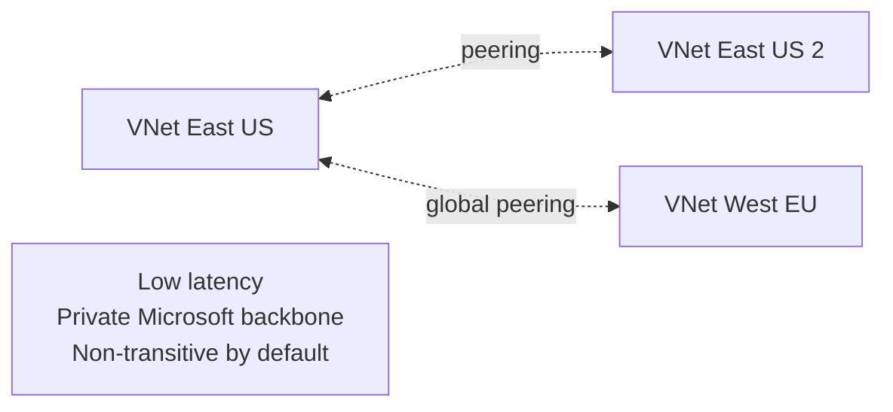

 **A->B peered, B->C peered, but A<->C? NO** unless you use **Hub-spoke + NVA/Firewall + UDRs**, or **Virtual WAN**.

---

### Load balancing - pick the right device

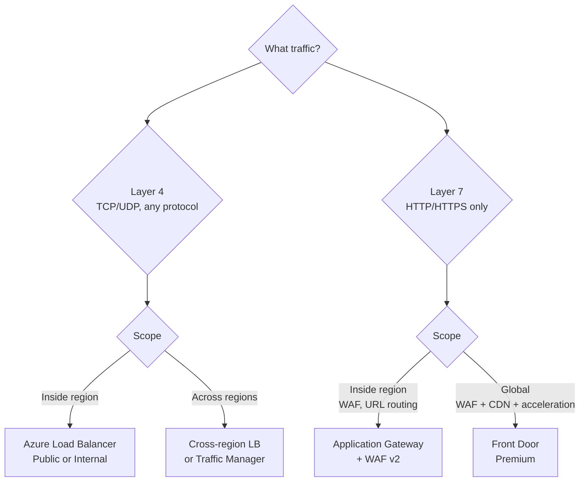

| Service | Layer | Scope | WAF | URL routing |
|---|---|---|---|---|
| **Load Balancer** | L4 | Regional / Global | |  |
| **App Gateway** | L7 | Regional | |  |
| **Front Door** | L7 | **Global** | |  |
| **Traffic Manager** | DNS | Global | |  |

 **Combo on the exam:** "Global users, WAF, fastest" -> **Front Door**.
 "Internal microservice over arbitrary TCP" -> **Internal Standard Load Balancer**.

---

### Network security stack

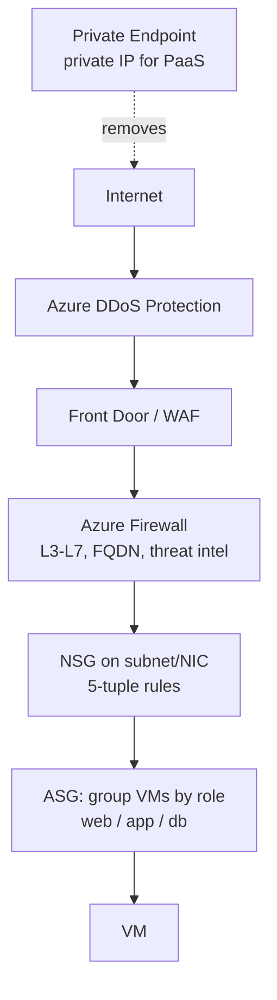

| Tool | Purpose |
|---|---|
| **NSG** | Stateful 5-tuple rules at subnet/NIC |
| **ASG** | Logical groups of VMs to use in NSG rules |
| **Azure Firewall** | Centralized stateful firewall, FQDN filtering, threat intel |
| **DDoS Protection Std/IP** | L3/L4 DDoS mitigation |
| **WAF** | L7 OWASP Top 10 (in App GW or Front Door) |
| **Private Endpoint** | Inject PaaS into your VNet via private IP |

 **NSG vs Azure Firewall:** NSG is free, basic; Firewall is paid, central, FQDN-aware, with logging.

---

### Azure DNS

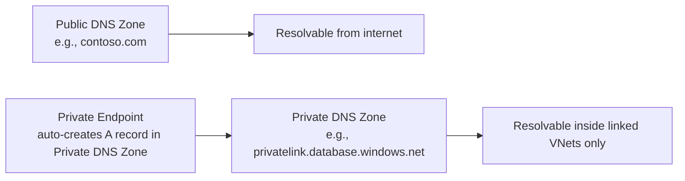

 **Private Endpoint setup always needs the matching Private DNS Zone** (e.g., `privatelink.blob.core.windows.net`) **linked to the VNet**.

---

## 5 Migration - Azure Migrate

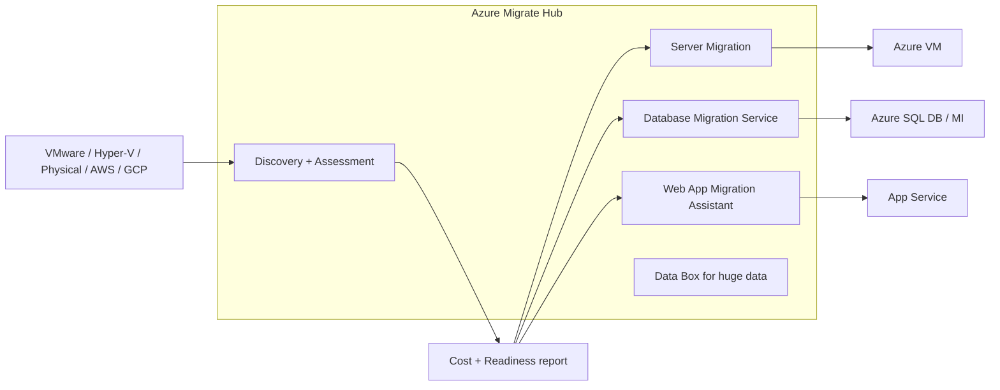

### The "6 Rs" of migration

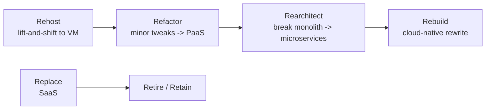

 **Exam:**
- "Move on-prem SQL to Azure with **minimal downtime**" -> **DMS online migration**
- "Move VMware VMs to Azure" -> **Azure Migrate Server Migration** (uses ASR under the hood)
- "Move ASP.NET site quickly" -> **Web App Migration Assistant** -> App Service

---

## 6 API Management - the API gateway

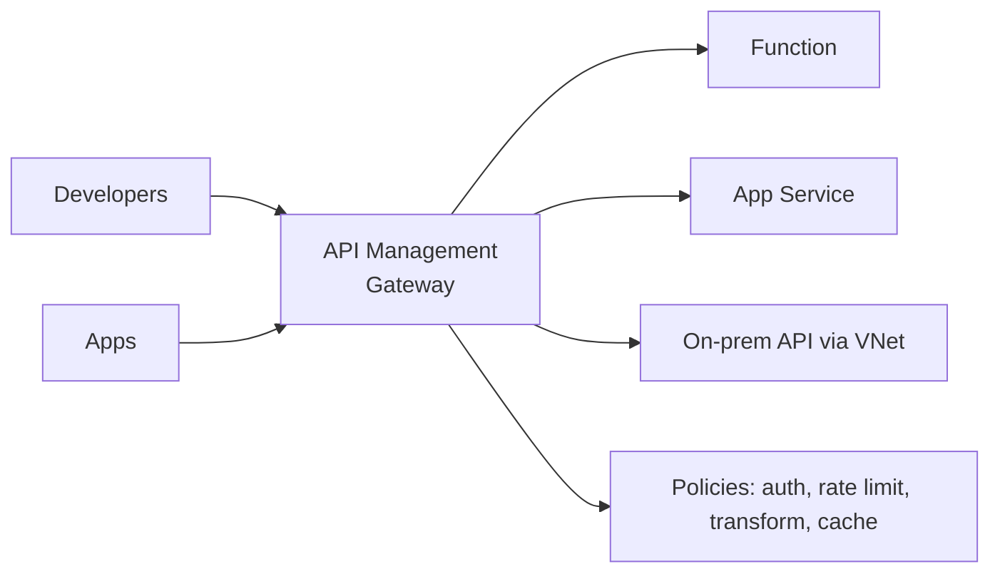

| Tier | When |
|---|---|
| **Consumption** | Pay-per-call, serverless, no VNet inject |
| **Basic / Standard v2** | Modern, VNet integration |
| **Premium** | Multi-region, full VNet, self-hosted gateways |

---

## 7 Messaging recap (also covered in Domain 2)

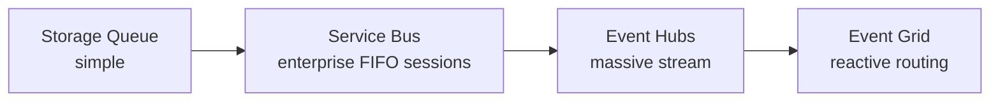

---

## Domain 4 cheat-sheet

| Scenario | Answer |
|---|---|
| Scale-to-zero microservices, no K8s | **Container Apps** |
| Need full K8s with CRDs | **AKS** |
| Run script when blob arrives | **Functions** Blob trigger |
| Multi-step SaaS workflow no-code | **Logic Apps** |
| Web app + 5 deployment slots | **App Service Standard** |
| Web app fully isolated in VNet | **App Service Environment v3** (Isolated) |
| Site-to-site, dedicated, SLA | **ExpressRoute** |
| Few remote workers connect to VNet | **P2S VPN** |
| Global HTTPS site + WAF + CDN | **Front Door Premium** |
| Regional HTTPS app + WAF | **App Gateway v2 + WAF** |
| Internal LB for arbitrary TCP | **Standard LB Internal** |
| Group VMs by role for NSG rules | **ASG** |
| Central FQDN filtering with threat intel | **Azure Firewall** |
| Inject PaaS into VNet (private IP) | **Private Endpoint** |
| Resolve `privatelink.*` for PE | **Private DNS Zone** linked to VNet |
| Migrate VMware to Azure | **Azure Migrate Server Migration** |
| Online migrate SQL to Azure | **Database Migration Service** |
| Hub-spoke at scale, SD-WAN | **Virtual WAN** |
| Single API front for many backends | **API Management** |

---

## References (Microsoft Learn)

- [AZ-305 study guide](https://learn.microsoft.com/credentials/certifications/resources/study-guides/az-305)
- [Compute decision tree](https://learn.microsoft.com/azure/architecture/guide/technology-choices/compute-decision-tree)
- [App Service plans](https://learn.microsoft.com/azure/app-service/overview-hosting-plans) - [Azure Functions hosting](https://learn.microsoft.com/azure/azure-functions/functions-scale)
- [Azure Kubernetes Service](https://learn.microsoft.com/azure/aks/intro-kubernetes) - [Container Apps](https://learn.microsoft.com/azure/container-apps/overview)
- [Hub-and-spoke topology](https://learn.microsoft.com/azure/architecture/networking/architecture/hub-spoke) - [Virtual WAN](https://learn.microsoft.com/azure/virtual-wan/virtual-wan-about)
- [ExpressRoute](https://learn.microsoft.com/azure/expressroute/expressroute-introduction) - [VPN Gateway](https://learn.microsoft.com/azure/vpn-gateway/vpn-gateway-about-vpngateways)
- [Private Endpoint](https://learn.microsoft.com/azure/private-link/private-endpoint-overview) - [Azure Firewall](https://learn.microsoft.com/azure/firewall/overview)
- [Azure Migrate](https://learn.microsoft.com/azure/migrate/migrate-services-overview) - [Cloud Adoption Framework](https://learn.microsoft.com/azure/cloud-adoption-framework/)
- [API Management](https://learn.microsoft.com/azure/api-management/api-management-key-concepts)

 **Final stop:** [05-exam-cheatsheet.md](05-exam-cheatsheet.md)
