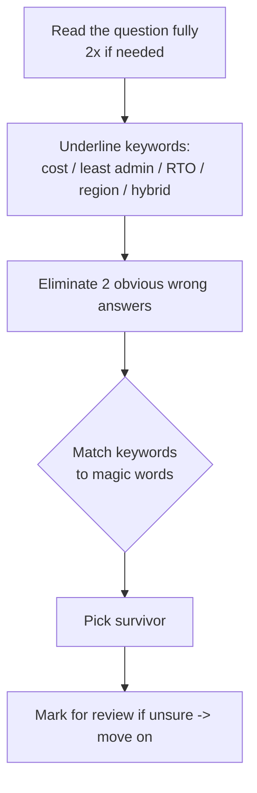
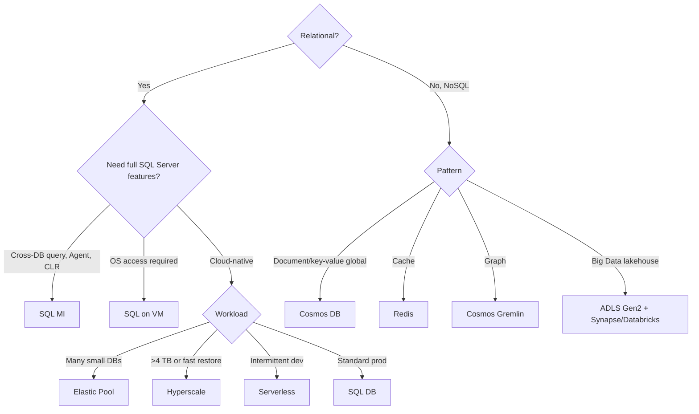
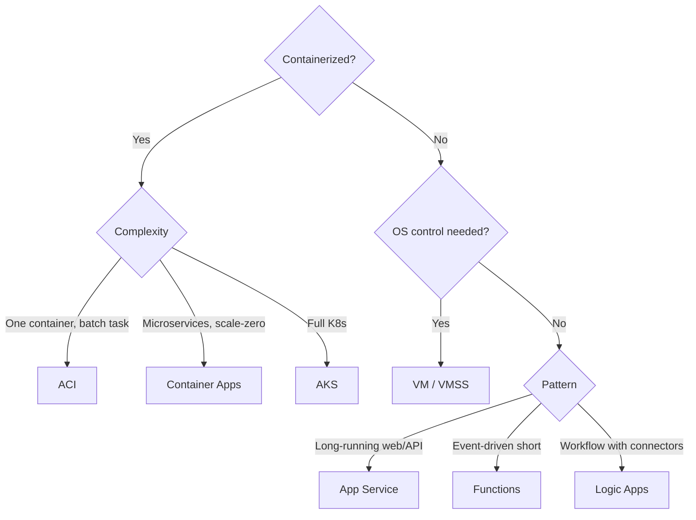
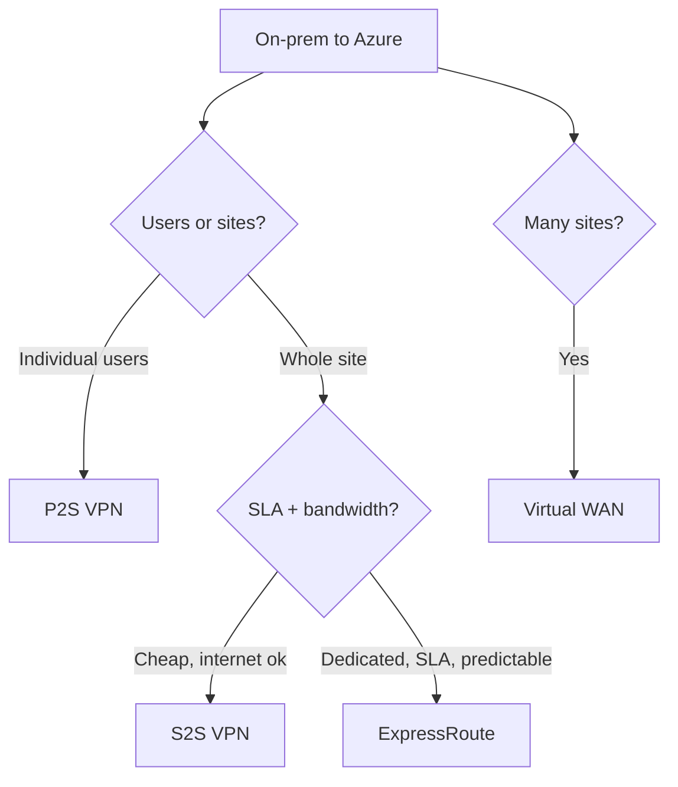
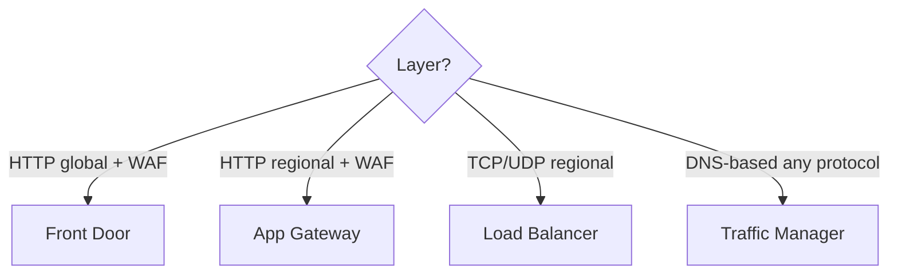
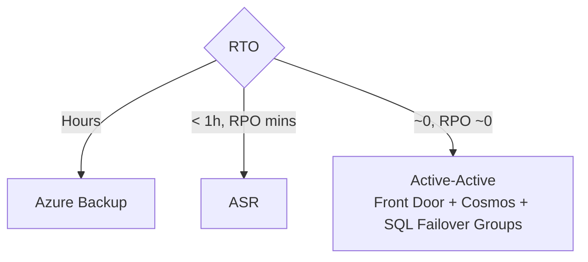
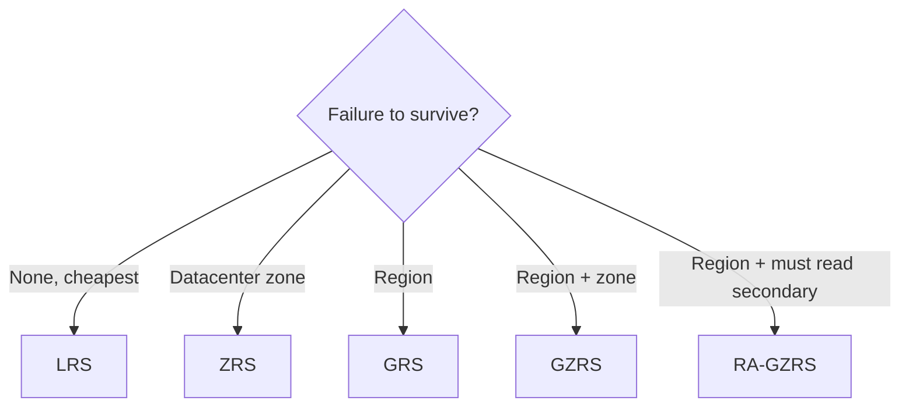
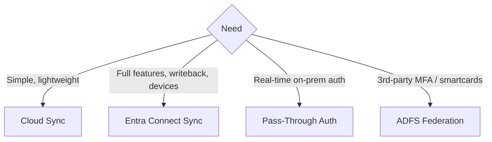

# AZ-305 Exam Decision Reference - One Page Per Decision

> A condensed decision reference for the four AZ-305 measured skill areas. Use it for a focused review before the exam, or as a team-friendly summary of the architecture decisions Microsoft tests most often. Aligned to the [Microsoft Learn AZ-305 study guide](https://learn.microsoft.com/credentials/certifications/resources/study-guides/az-305).

---

## The 60-second exam strategy

---

## Magic-words -> answer map

| When you see... | Pick... |
|---|---|
| "minimize administrative effort" | **PaaS / Managed Identity / Auto-failover groups** |
| "minimize cost" | **Consumption / Cool tier / LRS / Reserved instances** |
| "minimize downtime" / "highest SLA in region" | **Availability Zones** |
| "minimize downtime" / region failure | **ASR / Front Door / Cosmos multi-region** |
| "without storing credentials" | **Managed Identity** |
| "just-in-time" admin | **PIM** |
| "without exposing to internet" | **Private Endpoint** |
| "real-time on-prem password validation" | **Pass-Through Auth** |
| "lightweight, cloud-only sync agent" | **Entra Cloud Sync** |
| "writeback to on-prem AD" | **Entra Connect Sync** |
| "200+ small databases, varying load" | **Elastic Pool** |
| "100 TB SQL, fast restore" | **Hyperscale** |
| "DBA must not see PII" | **Always Encrypted** |
| "encryption with customer keys" | **CMK in Key Vault** |
| "global active writes NoSQL" | **Cosmos multi-region writes** |
| "read your own writes" | **Cosmos Session consistency** |
| "blob > 180 days, rarely accessed" | **Archive tier** |
| "1 million events/sec, Kafka-compatible" | **Event Hubs** |
| "FIFO + sessions + dead-letter" | **Service Bus** |
| "blob created -> run code" | **Event Grid -> Function** |
| "scale to zero, microservices, no K8s" | **Container Apps** |
| "deployment slots / blue-green web app" | **App Service Standard+** |
| "WAF + global + CDN" | **Front Door Premium** |
| "WAF in single region" | **App Gateway v2 WAF_v2** |
| "hub-spoke at scale + SD-WAN" | **Virtual WAN** |
| "low latency, dedicated, no internet" | **ExpressRoute** |
| "VMware lift to Azure" | **Azure Migrate Server Migration** |
| "online SQL migration" | **DMS** |
| "ransomware-proof backups" | **Immutable vault + Soft delete + MUA** |
| "policy should fix noncompliant resources" | **DeployIfNotExists** or **Modify** + managed identity |
| "copy data on a schedule with many connectors" | **Data Factory** / Synapse pipeline |
| "analytics over Cosmos DB without ETL" | **Synapse Link for Cosmos DB** |
| "private access to PaaS using private IP" | **Private Endpoint** + Private DNS |
| "dedicated private on-prem circuit" | **ExpressRoute** |
| "global HTTP with WAF and fast failover" | **Front Door Premium** |
| "regional HTTP WAF" | **Application Gateway WAF_v2** |
| "DNS-based failover, any protocol" | **Traffic Manager** |
| "test DR without impacting prod" | **ASR Test failover** |

---

## Universal decision trees

### Pick a database

### Pick compute

### Pick connectivity

### Pick load balancer

### Pick DR strategy by RTO/RPO

### Pick storage redundancy

### Pick identity sync

---

## Top 25 gotchas that fail people

1. **Availability Set != Availability Zone** - can't combine for same VM. Zones give 99.99%.
2. **Reserved subnet names** must be exact: `GatewaySubnet`, `AzureBastionSubnet`, `AzureFirewallSubnet`.
3. **VNet peering is non-transitive** - A<->B, B<->C does NOT mean A<->C.
4. **Private Endpoint** needs a **Private DNS Zone** (e.g., `privatelink.database.windows.net`) linked to the VNet, or DNS won't resolve.
5. **Archive blob** is offline - must **rehydrate** (hours) before reading.
6. **Premium block blob** = LRS or ZRS only (no GRS).
7. **Cosmos Strong consistency** is NOT supported with multi-region writes.
8. **Session consistency** (Cosmos default) != "session" affinity - it's per-client read-your-writes.
9. **Always Encrypted** hides PII from DBA; **TDE** does not.
10. **Service Endpoint** keeps traffic on Microsoft backbone but uses public IP; **Private Endpoint** uses a private IP and supports disabling public access.
11. **Front Door** is L7 HTTPS only. For TCP/UDP global, use **Cross-Region LB** or **Traffic Manager**.
12. **Traffic Manager** is DNS-based - failover speed is bound by **TTL**.
13. **Azure Policy `DeployIfNotExists`** and **`Modify`** require a **Managed Identity** for the policy assignment.
14. **Blueprints are deprecated** - modern answer is **Landing Zones (ALZ) + Initiatives + Template Specs**.
15. **PIM requires Entra ID P2**.
16. **Conditional Access requires Entra ID P1**.
17. **Cloud Sync** doesn't support all features Connect Sync does (no device writeback, limited filtering).
18. **SQL DB** does NOT natively support cross-database queries - use **MI** for that.
19. **SQL MI** must use a **dedicated subnet** with specific route/NSG requirements.
20. **Auto-failover groups** for SQL MI require **paired regions**.
21. **ASR** does NOT replace **Azure Backup** - use both (DR vs point-in-time recovery).
22. **Recovery Services Vault** redundancy is set at creation; can switch from GRS->LRS but not the other way once backups exist.
23. **Functions Consumption plan** has a **5-minute** default execution timeout (max 10 min). For longer, use Premium or Flex.
24. **App Service VNet integration** requires Standard or higher, **outbound only** unless paired with Private Endpoint for inbound.
25. **AKS upgrade** = control plane first, then node pools; node pools must be <= control-plane version.

---

## Number facts to memorize

| Fact | Value |
|---|---|
| VM single-instance SLA (Premium SSD) | 99.9% |
| Availability Set SLA | 99.95% |
| **Availability Zone SLA** | **99.99%** |
| Storage LRS copies | 3 |
| Storage ZRS copies | 3 (across zones) |
| Storage GRS copies | 6 (3+3) |
| Soft delete default | 14 days (vault), 7 days (storage) |
| Functions Consumption max timeout | 10 min |
| App Service slots Standard / Premium | 5 / 20 |
| Cosmos consistency levels | 5 |
| Cosmos serverless max | 1 TB / 5000 RU/s per container |
| ExpressRoute SLA | 99.95% |
| Azure Firewall SLA | 99.99% (Std/Premium with AZ) |
| Front Door SLA | 99.99% |
| Reserved subnets minimum size | /27 (Gateway), /26 (Bastion, Firewall) |
| GRS replication | Async, ~15-min RPO |

---

## Final 1-line summaries to chant

- **Identity** = Entra ID + CA + PIM + MI
- **Governance** = MG -> Sub -> RG -> Resource, with Policy + RBAC inheriting down
- **Monitoring** = Metrics (numeric) + Logs (KQL) + Alerts -> Action Groups
- **SQL** = DB (cloud) | MI (lift-shift) | VM (full control)
- **Cosmos** = Pick API, pick partition key, pick consistency, pick capacity mode
- **Storage** = Tier (Hot/Cool/Cold/Archive) x Redundancy (LRS/ZRS/GRS/GZRS)
- **Messaging** = Storage Q (simple) | Service Bus (enterprise) | Event Hubs (stream) | Event Grid (reactive)
- **HA** = Zones in region | ASR cross-region | Active-active for zero RTO
- **Backup** = RSV + Soft Delete + Immutable + GRS + CRR
- **Compute** = VM > App Service > Functions > Container Apps > AKS depending on control vs serverless
- **Network** = VNet + NSG + Private Endpoint + AFD/AppGW/LB + Firewall
- **Connectivity** = P2S < S2S < ExpressRoute < Virtual WAN
- **Migration** = Azure Migrate hub for everything

---

## You're ready when you can answer in <30 seconds:

 I see "lift-and-shift on-prem SQL" -> I instantly say **SQL MI**
 I see "minimize admin + secret-less app->KV" -> **Managed Identity**
 I see "global HTTPS app, WAF" -> **Front Door Premium**
 I see "scale to zero, no K8s knowledge" -> **Container Apps**
 I see "RPO seconds, RTO ~0 across regions" -> **Active-active + Cosmos + Failover Groups + Front Door**
 I see "ransomware" -> **Immutable vault + MUA + Soft delete**

 **Good luck - you've got this!**

 Back to [00-MASTER-INDEX.md](00-MASTER-INDEX.md)
