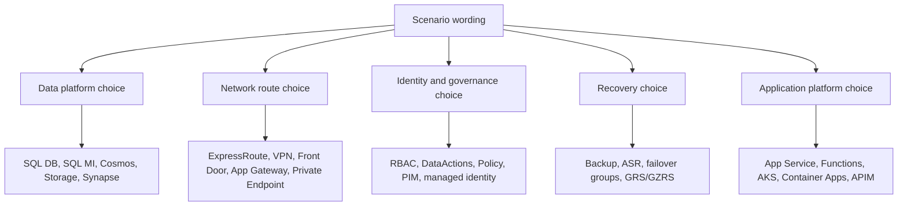
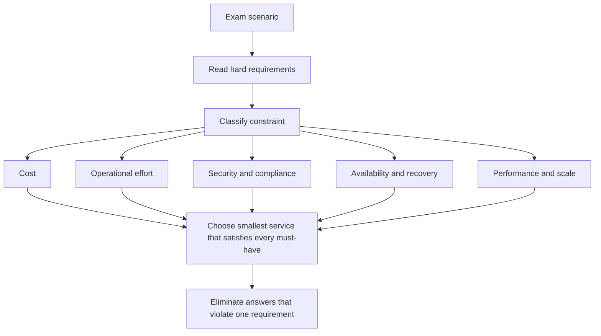
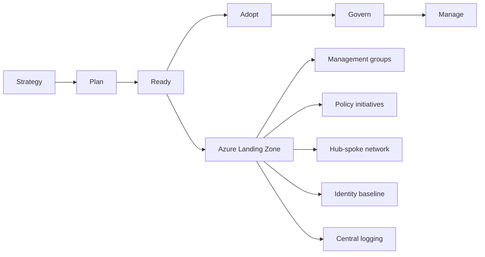
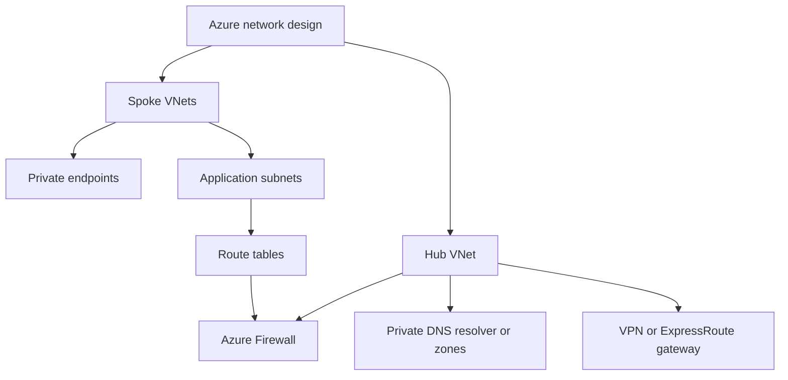
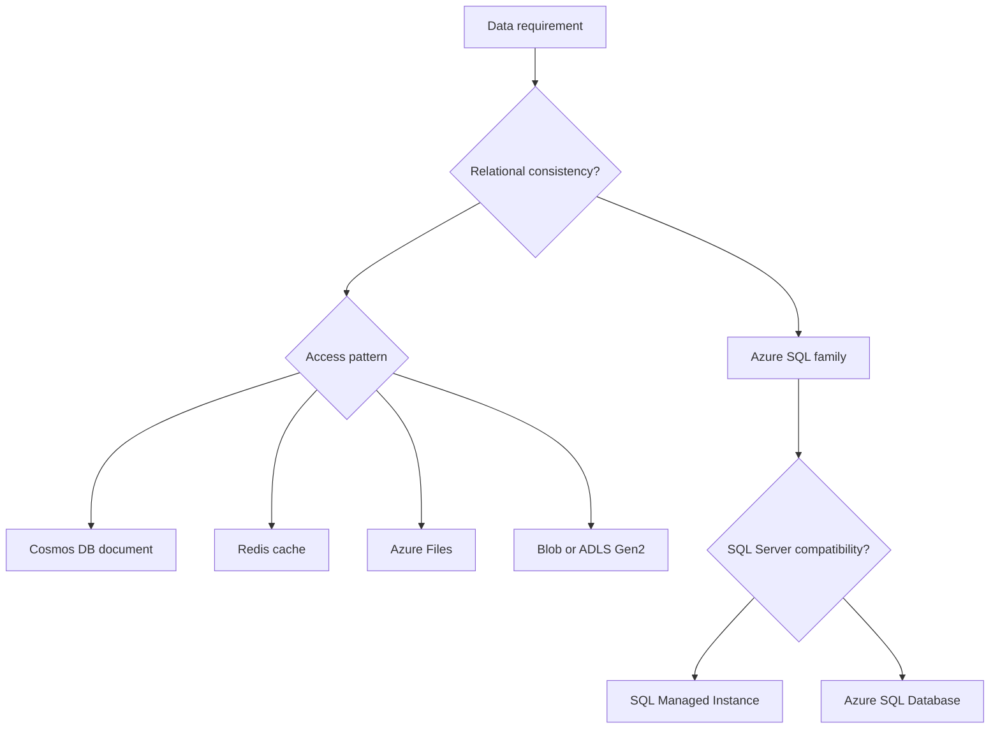
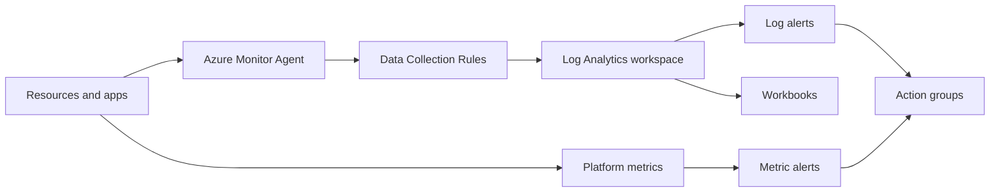

# AZ-305 Extra Concepts Bank

This page fills in exam-adjacent ideas that are easy to miss when studying only direct service decision trees. It is aligned to the [official Microsoft Learn AZ-305 skills measured](https://learn.microsoft.com/credentials/certifications/resources/study-guides/az-305) outline. Use it after the four domain pages and before the final exam decision reference.

## Recurring scenario clusters

Treat case-study questions as scenario shapes, not vocabulary checks; when a service detail seems off, trust the current Microsoft Learn behavior and the official skills outline.

## Architect answer style

The exam usually rewards the answer that meets every requirement with the least moving parts. If two answers work, prefer managed PaaS, built-in policy, managed identity, private endpoints, and native failover features.

## Well-Architected mapping

| Pillar | What the exam asks | Common answer direction |
|---|---|---|
| Reliability | SLA, RTO, RPO, failover, zones | Availability Zones, ASR, backup, Front Door, failover groups |
| Security | least privilege, no secrets, no public access | RBAC, PIM, managed identity, Private Link, Key Vault |
| Cost Optimization | cheapest while meeting requirements | serverless, autoscale, reservations, lifecycle tiers, right sizing |
| Operational Excellence | minimize admin effort, repeatable deployment | PaaS, policy, templates, monitoring, landing zones |
| Performance Efficiency | latency, throughput, scale | caching, autoscale, partitioning, CDN/Front Door, regional placement |

## Cloud Adoption Framework and landing zones

Exam clue: if the question is about many subscriptions, standard governance, repeatable environments, or enterprise scale, think management groups, policy initiatives, landing zones, hub-spoke networking, centralized logging, and shared services.

## Management group design

| Requirement | Design choice |
|---|---|
| Separate production from nonproduction | Separate management groups under tenant root |
| Different compliance policies by business unit | Business-unit management groups with inherited initiatives |
| Central security controls across all subscriptions | Assign policy and Defender settings high in the hierarchy |
| Isolate billing or quota boundaries | Separate subscriptions |
| Isolate lifecycle of resources | Resource groups, not subscriptions, unless governance differs |

## Identity traps

| Trap | Correct reasoning |
|---|---|
| Entra roles vs Azure RBAC | Entra roles manage the identity plane. Azure RBAC manages Azure resources. |
| Owner vs User Access Administrator | Owner can manage resources and access. User Access Administrator only manages access. |
| Managed identity vs service principal | Managed identity removes secret management for Azure-hosted workloads. |
| System-assigned vs user-assigned identity | System-assigned follows one resource lifecycle. User-assigned can be shared and pre-created. |
| B2B vs B2C | B2B is partner collaboration. B2C/External ID is customer-facing identity. |

## Network architecture extras

| Concept | Exam clue | Pick |
|---|---|---|
| Hub-spoke | shared firewall/connectivity/logging | Hub VNet + peered spokes |
| Virtual WAN | many branches, SD-WAN, large scale | Virtual WAN hub |
| Private Endpoint | PaaS private IP in VNet | Private Link + Private DNS |
| Service Endpoint | VNet to public service endpoint over backbone | Simpler, but public endpoint remains |
| NAT Gateway | many outbound connections, stable outbound IP | NAT Gateway on subnet |
| Bastion | secure RDP/SSH without public IP | Azure Bastion |

## DNS and Private Link checklist

If private endpoints do not work in an answer choice, check DNS.

| Resource | Private DNS zone pattern |
|---|---|
| Blob Storage | `privatelink.blob.core.windows.net` |
| Azure SQL | `privatelink.database.windows.net` |
| Key Vault | `privatelink.vaultcore.azure.net` |
| App Service | `privatelink.azurewebsites.net` |
| Cosmos DB SQL API | `privatelink.documents.azure.com` |

## Compute nuance

| Need | Best fit | Watch out |
|---|---|---|
| Legacy app with OS dependencies | VM or VMSS | More patching and backup responsibility |
| Standard web/API | App Service | Inbound private access needs Private Endpoint |
| Event-driven glue | Functions | Timeout/cold start depends on plan |
| Long workflow with SaaS connectors | Logic Apps | Great for orchestration, not heavy compute |
| Container app without Kubernetes admin | Container Apps | Good for KEDA/Dapr/serverless containers |
| Full Kubernetes platform | AKS | More operational responsibility |
| One-off container task | ACI | No orchestrator features |

## Data modeling extras

| Data clue | Architecture thought |
|---|---|
| OLTP transactions | SQL DB, SQL MI, PostgreSQL, MySQL |
| Global low-latency document data | Cosmos DB with partition key and regions |
| Analytical lake | ADLS Gen2 plus Synapse or Databricks |
| Cache reads or sessions | Azure Cache for Redis |
| Shared lift-and-shift file share | Azure Files |
| Immutable audit/archive | Blob immutability, legal hold, archive tier |

## Security architecture extras

| Requirement | Service or feature |
|---|---|
| Store application secrets | Key Vault |
| Rotate certificates/secrets | Key Vault + automation/Event Grid |
| Encrypt with your key | Customer-managed key in Key Vault or Managed HSM |
| Protect SQL sensitive columns from admins | Always Encrypted |
| Discover sensitive data | Microsoft Purview or Defender data discovery features |
| Central cloud security posture | Microsoft Defender for Cloud |
| Internet-facing HTTP protection | WAF on Front Door or Application Gateway |
| Network egress control | Azure Firewall or NAT Gateway depending on need |

## Monitoring and operations extras

| Question clue | Pick |
|---|---|
| Near-real-time numeric threshold | Metric alert |
| KQL query across logs | Log alert |
| Who changed a resource | Activity Log |
| Web dependency failures/exceptions | Application Insights |
| VM guest logs with modern agent | Azure Monitor Agent + DCR |
| AKS cluster observability | Container Insights |

## Migration extras

| Source | Assessment | Migration path |
|---|---|---|
| VMware/Hyper-V/physical servers | Azure Migrate appliance | Azure Migrate Server Migration |
| SQL Server | Data Migration Assistant or Azure Migrate | DMS to SQL DB/MI/VM |
| ASP.NET web app | App Service Migration Assistant | App Service |
| Large offline data | Data Box | Storage or Data Lake |
| File server | Azure File Sync planning | Azure Files + File Sync |

## Common elimination rules

| If an option says... | Eliminate when... |
|---|---|
| SQL on VM | requirement says minimize admin effort and SQL DB/MI supports the feature |
| Public endpoint | requirement says no internet exposure |
| Availability Set | requirement says zone/datacenter failure or 99.99 VM SLA |
| Traffic Manager | requirement needs WAF or TLS termination |
| Storage Queue | requirement needs sessions, FIFO, transactions, or dead-lettering |
| Service Endpoint | requirement needs private IP address for PaaS |
| Backup only | requirement needs RTO/RPO in minutes |
| Manual scripts | requirement asks repeatable governance across subscriptions |

Back to [00-MASTER-INDEX.md](00-MASTER-INDEX.md)