# Microsoft Learn Summaries

Tight, exam-focused summaries of every major service covered in this guide, structured the way Microsoft Learn presents them: **Overview -> Components -> Key concepts -> Integrations**. Each section includes a recreated architecture diagram (Microsoft's diagrams are not redistributed; concepts are summarized in our own words and visualized in Mermaid). Every section links back to the source Microsoft Learn page.

> Use this page when you want a 60-second refresher on a service before diving into the domain pages.

---

## 1. Azure API Management

Source: [What is Azure API Management?](https://learn.microsoft.com/azure/api-management/api-management-key-concepts)

Hybrid, multicloud PaaS that fronts your APIs with a **gateway**, **management plane**, and **developer portal** - covering the full API lifecycle for internal, partner, and public consumers.

### Components

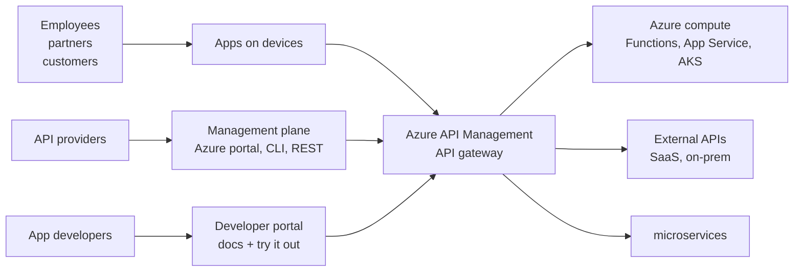

### Key concepts

- **APIs** - set of operations bound to a backend (REST, SOAP, GraphQL, gRPC, WebSocket, OData).
- **Products** - bundles of APIs published to consumers (open or subscription-protected).
- **Policies** - XML statements applied per global / workspace / product / API / operation: rate limit, JWT validation, cache, transform, route to backend, AI gateway logic.
- **Subscriptions** - issue API keys; gate access to protected products.
- **Workspaces** - federated API management; decentralized teams with central governance.
- **Self-hosted gateway** - Linux container deployed to AKS / Arc-enabled K8s for hybrid + on-prem APIs.

### Tiers (exam-relevant)

| Tier family | When to choose |
|---|---|
| **Consumption** | Serverless, pay-per-call, microservices, variable traffic |
| **Basic v2 / Standard v2** | Production with VNet integration to private backends |
| **Premium v2** | Full VNet injection, network isolation |
| **Premium (classic)** | Multi-region, availability zones, private backends, highest scale |

### Common AZ-305 patterns

- "Single front door for many APIs across regions" -> APIM Premium + Front Door / App Gateway in front.
- "Throttle a partner without changing the backend" -> policy with `rate-limit-by-key`.
- "Modernize a legacy SOAP service" -> APIM with SOAP-to-REST policy.
- "Govern internal LLM calls" -> APIM as **AI gateway** (token limit, semantic cache, content safety, load balance Azure OpenAI deployments).

---

## 2. Microsoft Entra ID

Source: [What is Microsoft Entra ID?](https://learn.microsoft.com/entra/fundamentals/whatis)

Cloud identity and access management for users, apps, and devices. Replaces Azure AD as the foundation for Microsoft 365, Azure resources, and SaaS SSO.

### Components

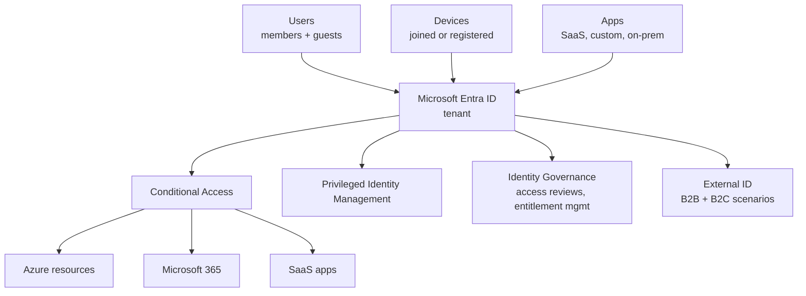

### Key concepts

- **Tenant** - dedicated identity boundary; one per organization.
- **Members vs guests** - guests come from B2B invitations.
- **Conditional Access** - signal-based policies (user, device, location, risk) granting / blocking / requiring MFA.
- **PIM** - just-in-time elevation for Azure roles and Entra roles with approval and audit.
- **Managed identities** - Azure-managed credentials for workloads; system-assigned (lifecycle = resource) or user-assigned (shared).
- **Application roles vs Entra roles vs Azure RBAC** - three separate planes; do not confuse.

### Integrations

- Azure RBAC, Microsoft Defender for Identity, Microsoft Sentinel, Intune, Microsoft 365.

---

## 3. Azure Front Door

Source: [What is Azure Front Door?](https://learn.microsoft.com/azure/frontdoor/front-door-overview)

Global Layer-7 load balancer + CDN + WAF on Microsoft's edge. Anycast entry for HTTP/S workloads with TLS termination and origin failover.

### Architecture

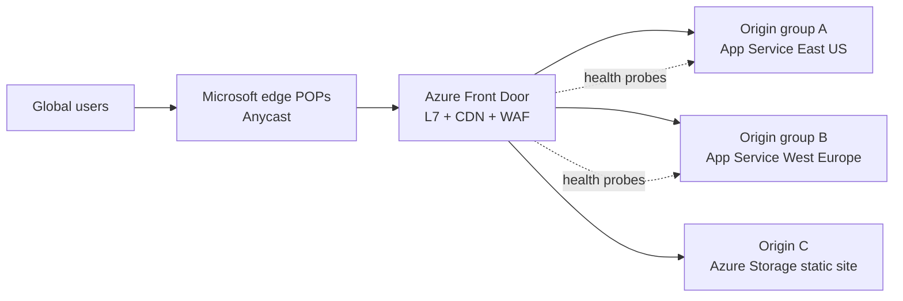

### Key concepts

- **Profiles** - Standard (CDN + L7) vs Premium (adds WAF, Private Link to origin, bot protection).
- **Endpoints / routes / origin groups / origins** - routing hierarchy.
- **WAF policies** - managed rule sets (OWASP, bot manager) + custom rules.
- **Private Link to origin** - Premium only; reach private backends without public IP.

### Choose Front Door vs Application Gateway vs Traffic Manager

| Need | Pick |
|---|---|
| Global HTTP entry + CDN + WAF | **Front Door** |
| Regional HTTP load balancer with WAF, URL routing, mTLS | **Application Gateway** |
| DNS-based global routing (any TCP/UDP) | **Traffic Manager** |
| Regional non-HTTP TCP/UDP load balancing | **Azure Load Balancer** |

---

## 4. Azure Application Gateway

Source: [What is Application Gateway?](https://learn.microsoft.com/azure/application-gateway/overview)

Regional Layer-7 load balancer with optional **Web Application Firewall**. Listeners + rules route by hostname / path to backend pools.

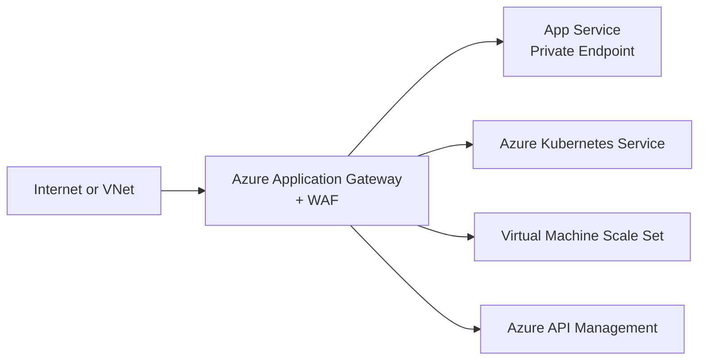

### Key concepts

- **Frontend IP** - public, private, or both.
- **Listeners** - port + protocol + hostname (multi-site).
- **Rules** - basic or path-based routing to backend pools.
- **Backend pool** - IPs, FQDNs, NICs, App Service, AKS via AGIC.
- **WAF v2** - OWASP CRS, custom rules, geo-filter, bot protection.
- **Autoscaling v2 SKU** is the production default.

---

## 5. Azure Firewall

Source: [What is Azure Firewall?](https://learn.microsoft.com/azure/firewall/overview)

Cloud-native, stateful, fully managed network firewall as a service. Centralized egress / east-west / DNAT control for hub-spoke and Virtual WAN.

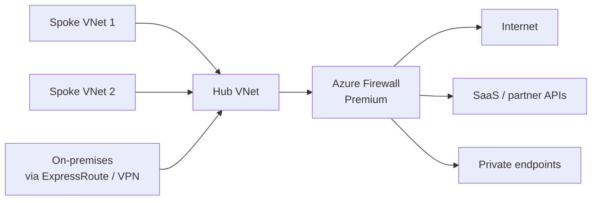

### Tiers

| Tier | Headline features |
|---|---|
| Standard | Network + application rules, threat intel, FQDN tags |
| **Premium** | TLS inspection, IDPS, URL filtering, web categories |
| Basic | Small environments < 250 Mbps |

### Concepts

- **Firewall Policy** - hierarchical, shareable across firewalls.
- **Rule collections** - DNAT -> Network -> Application (priority order).
- **Forced tunneling** - send all traffic via on-prem.

---

## 6. Azure Private Link & Private Endpoint

Source: [What is Azure Private Link?](https://learn.microsoft.com/azure/private-link/private-link-overview)

Private, VNet-routed access to Azure PaaS, customer-owned, and partner services using a NIC inside your VNet - traffic never crosses the public internet.

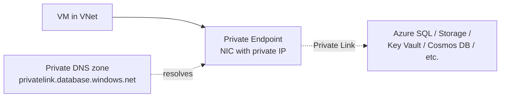

### Concepts

- **Private endpoint** - your-side NIC; one per target sub-resource (e.g., `blob`, `file`, `sqlServer`).
- **Private Link service** - provider-side; expose your own L4 load balancer to consumers.
- **Private DNS zone** - `privatelink.<service>.<suffix>`; required so the public FQDN resolves to the private IP.
- Disable public access on the PaaS resource for true isolation.

---

## 7. Azure Key Vault

Source: [About Azure Key Vault](https://learn.microsoft.com/azure/key-vault/general/overview)

Centralized store for **secrets**, **keys**, and **certificates** with HSM-backed protection, RBAC, and audit.

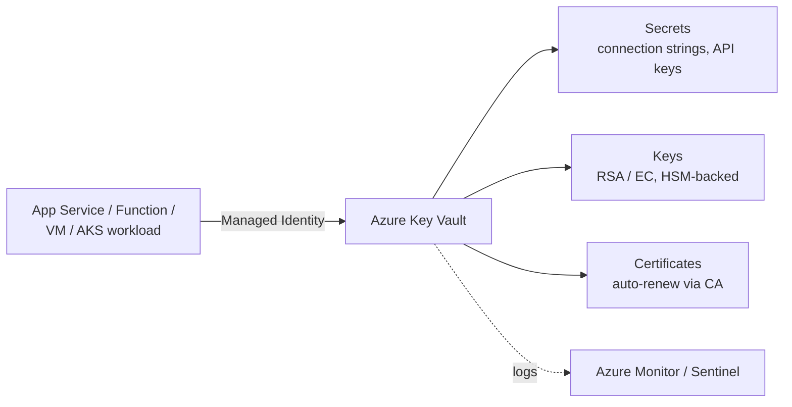

### Two access models (Premium / Standard)

| Model | Use |
|---|---|
| **Azure RBAC** (recommended) | Roles like Key Vault Secrets User; tenant-wide governance |
| Vault access policies (legacy) | Per-vault ACL; being phased out |

### Concepts

- **Soft-delete + purge protection** - turn on; required for production and for some compliance.
- **Managed HSM** - FIPS 140-2 Level 3 single-tenant HSM pool.
- **Customer-Managed Keys (CMK)** - encryption keys in Key Vault used by Storage, SQL, Disk, etc.

---

## 8. Azure SQL family

Source: [Azure SQL overview](https://learn.microsoft.com/azure/azure-sql/azure-sql-iaas-vs-paas-what-is-overview)

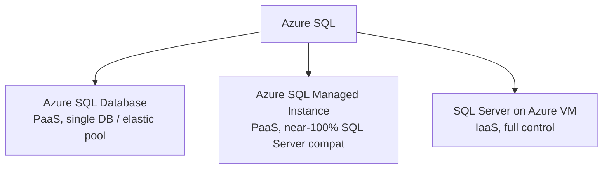

### Decision shortcuts

| Requirement | Pick |
|---|---|
| Greenfield app, scale per DB, lowest mgmt | **Azure SQL Database** |
| Lift-and-shift with SQL Agent, cross-DB queries, CLR, Service Broker | **SQL Managed Instance** |
| Need OS access, custom SQL build, replication features not on PaaS | **SQL on VM** |
| Multi-region active-active reads | SQL DB **Hyperscale** + geo-replication or MI **failover groups** |
| RPO ~ 0, RTO seconds, same region | Zone-redundant Business Critical / Premium |

### Key concepts

- **Service tiers**: General Purpose, Business Critical, Hyperscale.
- **Failover groups** - DNS-based automatic failover across regions.
- **Auditing + Defender for SQL** - security baseline.
- **Always Encrypted, TDE with CMK, dynamic data masking, row-level security**.

---

## 9. Azure Cosmos DB

Source: [Welcome to Azure Cosmos DB](https://learn.microsoft.com/azure/cosmos-db/introduction)

Globally distributed, multi-model NoSQL database with single-digit-ms latency and SLA-backed 99.999% availability.

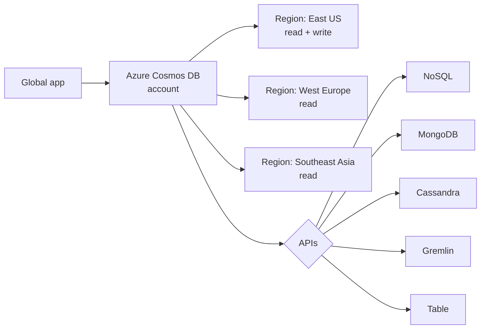

### Key concepts

- **Partition key** - pick a high-cardinality, evenly-distributed property; immutable.
- **Throughput** - provisioned RU/s (manual / autoscale) or **serverless**.
- **Consistency levels** - Strong, Bounded staleness, Session (default), Consistent prefix, Eventual.
- **Multi-region writes** - opt-in; resolve conflicts via LWW or custom procedure.
- **Change feed** - drives event-driven pipelines (Functions, Synapse Link).

---

## 10. Azure Storage

Source: [Introduction to Azure Storage](https://learn.microsoft.com/azure/storage/common/storage-introduction)

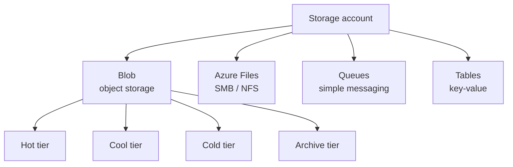

### Redundancy

| Option | Scope | Survives |
|---|---|---|
| LRS | 1 datacenter | Disk failure |
| ZRS | 3 zones in 1 region | Zone outage |
| GRS | Region pair (async) | Region outage (manual failover) |
| GZRS | ZRS + GRS | Zone + region outage |
| RA-GRS / RA-GZRS | + read access on secondary | Read during DR |

### Concepts

- **Lifecycle management** - auto-tier blobs Hot -> Cool -> Cold -> Archive; delete by age.
- **Immutable storage / legal hold** - WORM compliance.
- **Private endpoints** - one per sub-resource (`blob`, `file`, `dfs`, `queue`, `table`, `web`).
- **CMK** with Key Vault for encryption at rest.
- **ADLS Gen2** = hierarchical namespace + ACLs on blob.

---

## 11. Azure App Service

Source: [App Service overview](https://learn.microsoft.com/azure/app-service/overview)

Managed PaaS for web apps, REST APIs, and mobile backends - Linux or Windows, code or container.

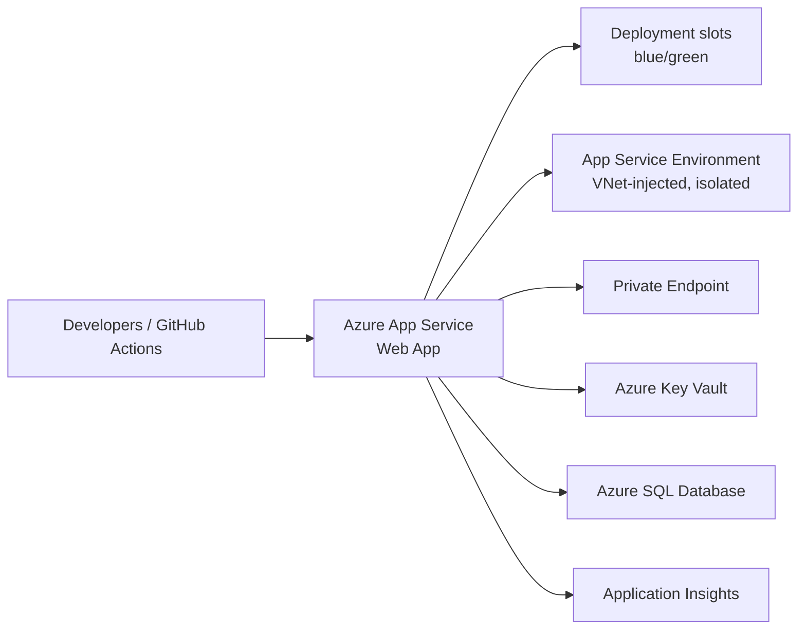

### Concepts

- **Plan tiers** - Free/Shared (dev), Basic, Standard, Premium v3, **Isolated v2** (ASE).
- **Deployment slots** - staging slots with swap (Standard+).
- **VNet integration** - outbound to VNet; **Private Endpoint** for inbound private ingress.
- **Authentication / Authorization (Easy Auth)** - Entra ID, Google, Facebook, custom OIDC with no code.

---

## 12. Azure Functions

Source: [Azure Functions overview](https://learn.microsoft.com/azure/azure-functions/functions-overview)

Event-driven serverless compute. Triggers + bindings remove plumbing code.

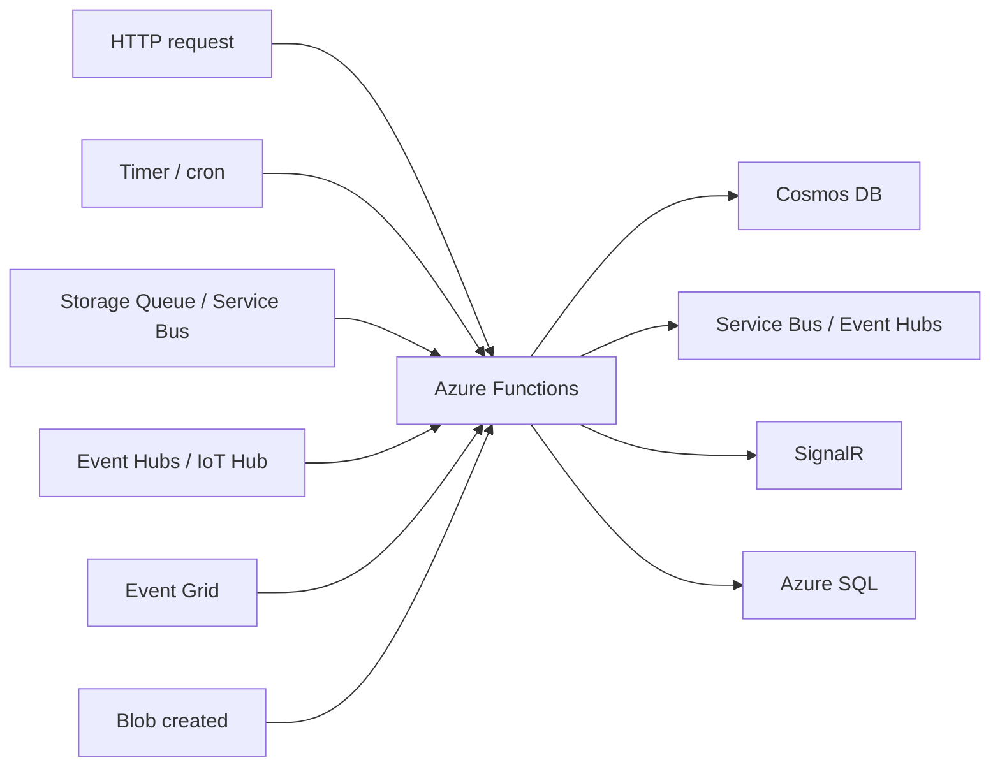

### Hosting plans

| Plan | Pick when |
|---|---|
| **Consumption** | Bursty, low/variable load, cold start OK |
| **Flex Consumption** | Per-instance concurrency + VNet, large memory, fast scale |
| **Premium** | Always-warm, VNet, longer execution |
| **Dedicated (App Service Plan)** | Reuse existing plan, predictable cost |
| **Container Apps hosted** | Container-based functions with KEDA scale |

---

## 13. Azure Kubernetes Service (AKS)

Source: [What is Azure Kubernetes Service?](https://learn.microsoft.com/azure/aks/intro-kubernetes)

Managed Kubernetes. Microsoft runs the control plane; you manage worker node pools.

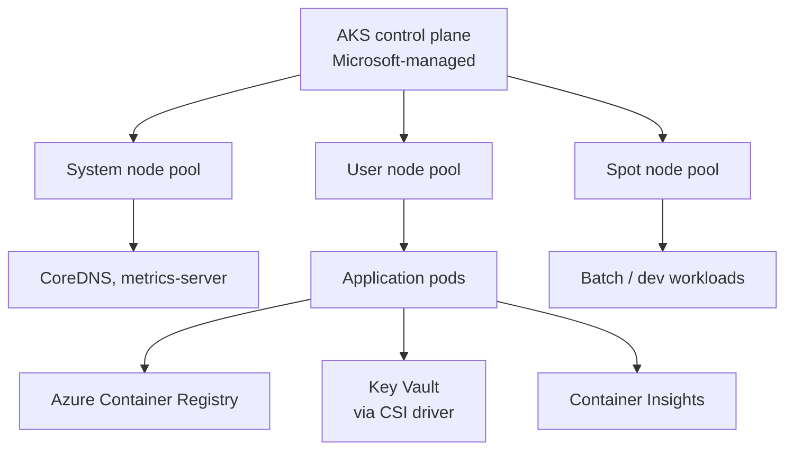

### Key concepts

- **SKU**: Automatic (opinionated, production defaults) vs **Standard** (full control).
- **Networking**: Azure CNI Overlay (recommended) vs kubenet (legacy) vs Azure CNI.
- **Identity**: **Workload Identity** (federated) replaces pod-managed identity.
- **Autoscaling**: Cluster Autoscaler + KEDA + HPA.
- **Add-ons**: Azure Monitor, Application Routing, Key Vault CSI, Azure Policy, Defender.

---

## 14. Azure Container Apps

Source: [Azure Container Apps overview](https://learn.microsoft.com/azure/container-apps/overview)

Serverless containers on Kubernetes (KEDA + Dapr + Envoy under the hood) - without managing K8s.

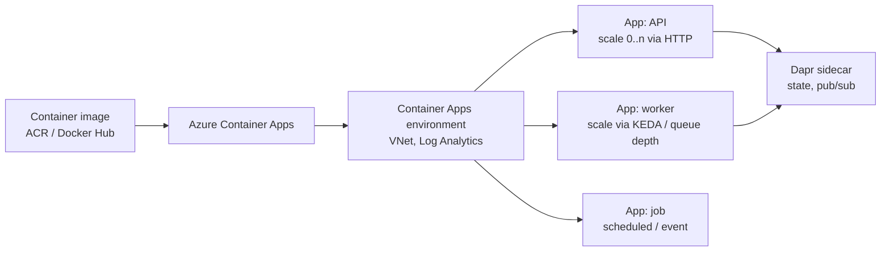

### Choose AKS vs Container Apps vs App Service

| Need | Pick |
|---|---|
| Full K8s API, custom controllers, GPU pools | **AKS** |
| Microservices with HTTP / event scale, no K8s ops | **Container Apps** |
| Single web app or API, code or container, slots | **App Service** |
| Single container, throwaway batch | **Container Instances** |

---

## 15. Azure Monitor stack

Source: [Azure Monitor overview](https://learn.microsoft.com/azure/azure-monitor/overview)

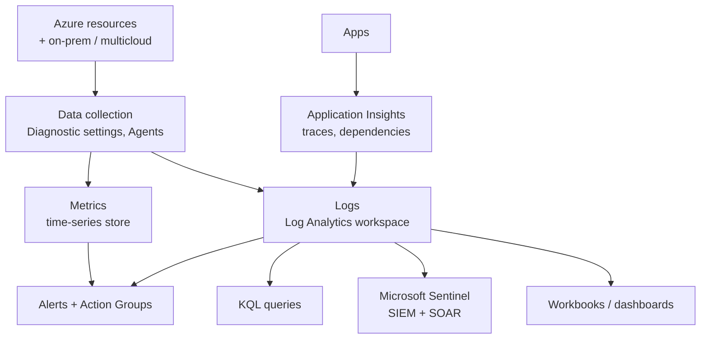

### Concepts

- **Log Analytics workspace** - single sink; design with RBAC + data residency in mind.
- **Diagnostic settings** - per-resource; route platform logs/metrics to workspace, Storage, or Event Hub.
- **Data collection rules (DCR)** - modern agent config for VMs and containers.
- **Action groups** - email, SMS, webhook, Logic App, Functions, ITSM.
- **Sentinel** - SIEM built on Log Analytics with connectors, analytics rules, playbooks.

---

## 16. Azure Backup & Site Recovery

Source: [Backup overview](https://learn.microsoft.com/azure/backup/backup-overview) - [Site Recovery overview](https://learn.microsoft.com/azure/site-recovery/site-recovery-overview)

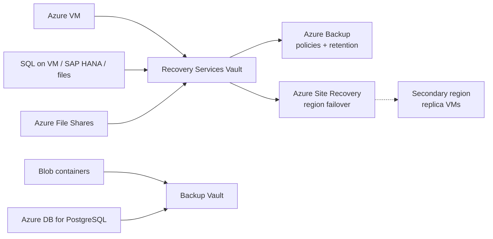

### Concepts

- **Recovery Services vault** - VMs, SQL on VM, file shares, ASR.
- **Backup vault** - newer; blobs, disks, PostgreSQL, AKS.
- **Soft delete + immutable vault** - protect against ransomware and accidental deletion.
- **Cross-region restore** - RA-GRS-backed; restore in paired region.
- **ASR** - replicate VMs region-to-region; orchestrate failover with **recovery plans**.

### RTO / RPO mental model

| Goal | Mechanism |
|---|---|
| RPO seconds, RTO minutes | Active-active (Front Door + zone-redundant PaaS) |
| RPO minutes, RTO < 1 hr | ASR + recovery plans |
| RPO hours, RTO hours | Azure Backup restore |
| Long retention / compliance | Backup with locked policy + immutable vault |

---

## 17. Azure governance: Management Groups, Policy, Blueprints, Landing Zones

Source: [Cloud Adoption Framework - Azure landing zone](https://learn.microsoft.com/azure/cloud-adoption-framework/ready/landing-zone/)

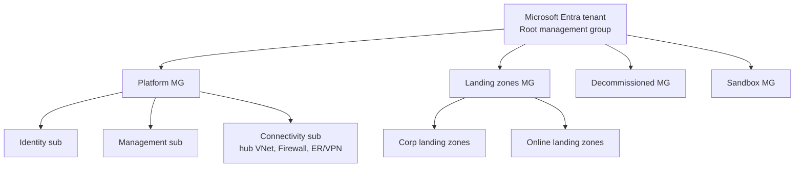

### Concepts

- **Management Group** - container for subscriptions; policies and RBAC inherit downward.
- **Azure Policy** - definitions + initiatives + assignments; effects: Audit, Deny, DeployIfNotExists, Modify, AuditIfNotExists, Append.
- **Resource locks** - `CanNotDelete`, `ReadOnly` at sub / RG / resource.
- **Blueprints** - being superseded by Template Specs + Deployment Stacks.
- **Azure Landing Zone Accelerator** - opinionated reference deployment (ALZ Bicep / Terraform).

---

## 18. Azure networking core: VNet, hub-spoke, ExpressRoute, VPN

Source: [VNet overview](https://learn.microsoft.com/azure/virtual-network/virtual-networks-overview) - [Hub-spoke topology](https://learn.microsoft.com/azure/architecture/networking/architecture/hub-spoke)

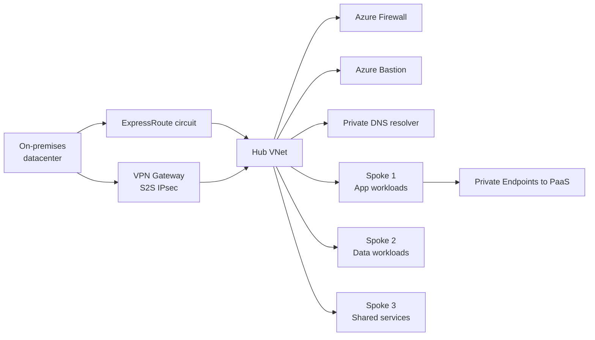

### Concepts

- **VNet peering** - non-transitive; transitive routing requires Azure Firewall / NVA / Virtual WAN.
- **Virtual WAN** - Microsoft-managed hub; preferred for many sites or global mesh.
- **ExpressRoute** - private peering, no internet; SKUs: Local, Standard, Premium (global reach).
- **VPN Gateway** - IPsec S2S, P2S; SKUs scale tunnels and bandwidth.
- **Bastion** - RDP/SSH via portal without public IP on VMs.
- **NSG vs ASG vs Firewall** - NSG L3/L4 stateful per-NIC/subnet; ASG groups VMs by tag; Firewall L7 + threat intel.

---

## 19. Azure Synapse Analytics & Data Factory

Source: [Synapse overview](https://learn.microsoft.com/azure/synapse-analytics/overview-what-is) - [Data Factory overview](https://learn.microsoft.com/azure/data-factory/introduction)

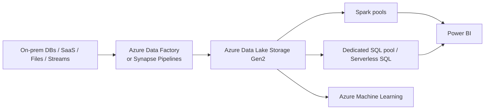

### Concepts

- **Dedicated SQL pool** - MPP data warehouse, DWU billing.
- **Serverless SQL pool** - ad-hoc T-SQL over data lake, pay-per-TB scanned.
- **Spark pool** - managed Apache Spark for notebooks and pipelines.
- **Synapse Link** - near-real-time analytics over Cosmos DB / SQL / Dataverse without ETL.
- **Data Factory** - code-free ELT; mapping data flows run on Spark.

---

## 20. Azure Cache for Redis

Source: [Azure Cache for Redis overview](https://learn.microsoft.com/azure/azure-cache-for-redis/cache-overview)

In-memory data store: cache, session store, pub/sub, distributed lock, leaderboard.

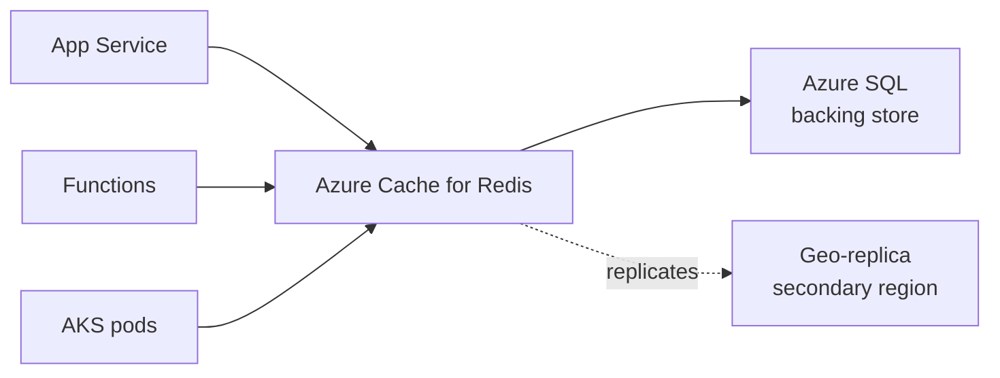

### Tiers

| Tier | Headline |
|---|---|
| Basic | Single node, dev only |
| Standard | Primary/replica HA |
| Premium | Clustering, persistence, VNet, geo-replication |
| Enterprise / Enterprise Flash | RediSearch, RedisJSON, active-active geo |
| **Azure Managed Redis** (newer) | Modern Premium replacement on Enterprise stack |

---

## 21. Event-driven messaging: Event Grid, Event Hubs, Service Bus

Source: [Compare messaging services](https://learn.microsoft.com/azure/event-grid/compare-messaging-services)

```mermaid
flowchart TD
    PUB[Publishers] --> CHOICE{Pattern}
    CHOICE --> EG[Event Grid<br/>discrete events<br/>reactive]
    CHOICE --> EH[Event Hubs<br/>big-data streams<br/>millions/sec]
    CHOICE --> SB[Service Bus<br/>enterprise messaging<br/>queues + topics]
    EG --> FN1[Functions / Logic Apps / webhooks]
    EH --> STREAM[Stream Analytics / Spark / Fabric]
    SB --> WORKERS[Workers, transactional handlers]
```

### Decision shortcuts

| Phrase in scenario | Pick |
|---|---|
| "react to a state change", "blob created", "resource event" | **Event Grid** |
| "telemetry", "millions of events", "Kafka", "stream" | **Event Hubs** |
| "FIFO", "sessions", "transactions", "dead-letter", "duplicate detection" | **Service Bus** |

---

## 22. Azure Logic Apps

Source: [What is Azure Logic Apps?](https://learn.microsoft.com/azure/logic-apps/logic-apps-overview)

Low-code workflow engine with 1,000+ connectors.

```mermaid
flowchart LR
    TRIG[Trigger<br/>HTTP / schedule / connector event] --> LA[Logic App workflow]
    LA --> ACT1[SaaS connector<br/>Salesforce, ServiceNow, SAP]
    LA --> ACT2[Azure connector<br/>Storage, SQL, Service Bus]
    LA --> ACT3[Custom action<br/>Function / API call]
    LA -. logs .-> AI[Application Insights]
```

- **Consumption** - multitenant, pay-per-action.
- **Standard** - single-tenant, VNet integration, multiple workflows per app, local dev.

---

## How to use this page on the exam

1. Spot the **service name** in the question.
2. Jump to that section here for the components diagram and key concepts.
3. Cross-check with the matching domain page (01-04) and the [Exam Decision Reference](05-exam-cheatsheet.md).
4. Pick the answer that matches the **least-moving-parts, fully-managed, identity-based, private-by-default** pattern.

> Sources: every link in this page points to the official Microsoft Learn article it was summarized from. Diagrams here are original Mermaid recreations of the concepts on those pages.
